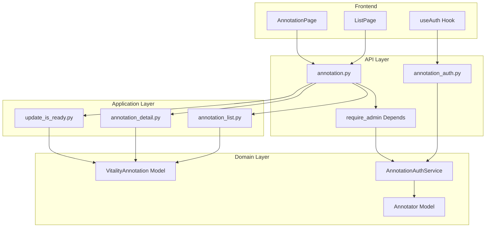
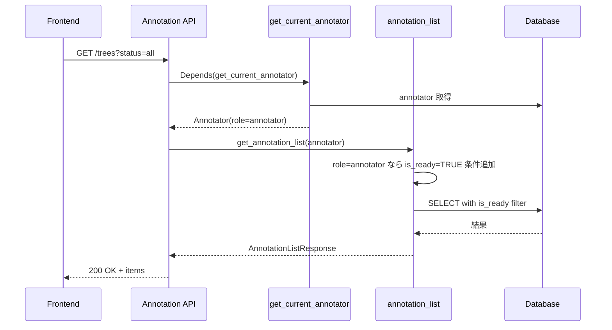
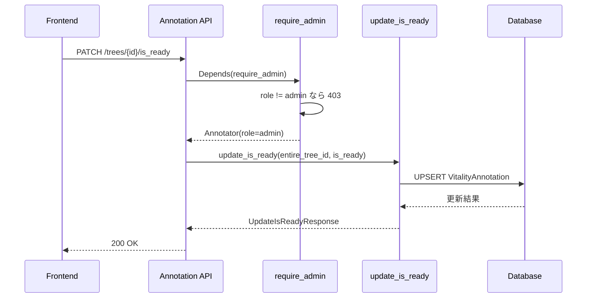
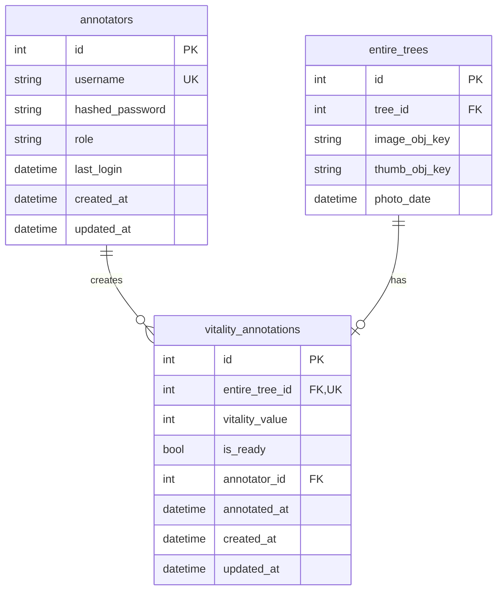
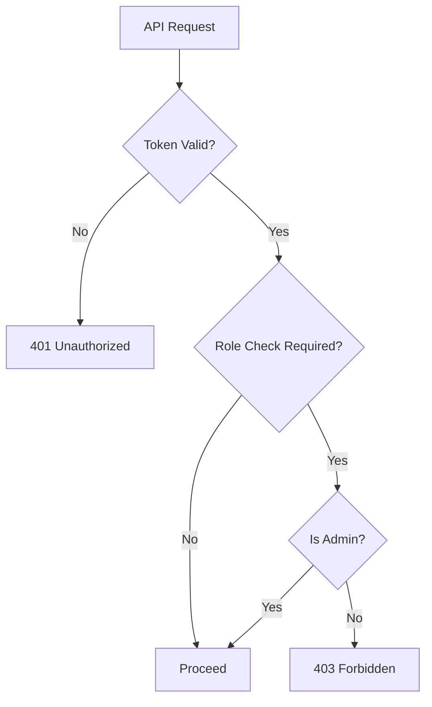

# Design Document: annotation-readiness-permission

## Overview

**Purpose**: 本機能は、アノテーションシステムに「評価準備完了」(is_ready) フラグと権限管理機能を追加し、管理者がアノテーション対象画像を事前選別できるようにする。

**Users**:
- 管理者（admin）: すべての画像を閲覧し、is_ready フラグを変更してアノテーション対象を選別
- 一般アノテーター（annotator）: 準備完了した画像のみを閲覧し、アノテーションを実行

**Impact**: 既存の Annotator モデルと VitalityAnnotation モデルにカラムを追加し、API・フロントエンドに権限ベースのフィルタリングとUI制御を実装する。

### Goals
- annotators テーブルに role カラムを追加し、admin/annotator の2種類の権限を管理
- vitality_annotations テーブルに is_ready カラムを追加し、画像の評価準備状態を管理
- 権限に応じた画像一覧のフィルタリングとアクセス制御
- フロントエンドでの権限ベースUI制御

### Non-Goals
- 複雑なロール階層や権限グループの実装（将来検討）
- is_ready 以外の画像メタデータ管理
- 管理者向けダッシュボード機能

## Architecture

### Existing Architecture Analysis

既存のアノテーションシステムは以下の構造を持つ:

- **Domain Layer**: `Annotator`, `VitalityAnnotation` モデル
- **Application Layer**: `annotation_list.py`, `annotation_detail.py`, `save_annotation.py`
- **Interfaces Layer**: `annotation.py`, `annotation_auth.py` (API), `annotation.py` (schemas)
- **Frontend**: React + TypeScript, useAuth フックによる認証状態管理

既存パターン:
- JWT 認証（AnnotationAuthService）
- FastAPI Depends による依存性注入
- SQLAlchemy Mapped 型アノテーション
- Pydantic スキーマによるリクエスト/レスポンス検証

### Architecture Pattern & Boundary Map



**Architecture Integration**:
- Selected pattern: レイヤードアーキテクチャの既存パターンを踏襲
- Domain/feature boundaries: 認可ロジックは Domain 層の AuthService に集約、フィルタリングは Application 層
- Existing patterns preserved: JWT 認証、Depends パターン、Mapped 型アノテーション
- New components rationale: `require_admin` 依存関数（認可）、`update_is_ready` ユースケース（is_ready 更新）
- Steering compliance: Clean Architecture 風のレイヤー分離を維持

### Technology Stack

| Layer | Choice / Version | Role in Feature | Notes |
|-------|------------------|-----------------|-------|
| Frontend | React 18 + TypeScript 5 | UI制御、権限ベース表示切替 | 既存スタックを継続 |
| Backend | FastAPI 0.115 + Python 3.12 | API エンドポイント、認可 | 既存スタックを継続 |
| Data | MySQL 8.0 + SQLAlchemy 2.0 | role/is_ready カラム追加 | Alembic マイグレーション |

## System Flows

### 権限ベース画像一覧取得フロー



### is_ready フラグ更新フロー



## Requirements Traceability

| Requirement | Summary | Components | Interfaces | Flows |
|-------------|---------|------------|------------|-------|
| 1.1 | is_ready カラム追加 | VitalityAnnotation | - | - |
| 1.2 | is_ready 保持 | save_annotation | POST /annotation | - |
| 1.3 | is_ready インデックス | VitalityAnnotation | - | - |
| 2.1 | role カラム追加 | Annotator | - | - |
| 2.2 | admin/annotator ロール定義 | Annotator, AuthService | - | - |
| 2.3 | デフォルト role | Annotator | - | - |
| 2.4 | role バリデーション | AnnotationAuthService | - | - |
| 3.1 | annotator の is_ready フィルター | annotation_list | GET /trees | 権限ベース一覧取得 |
| 3.2 | admin の全件表示 | annotation_list | GET /trees | 権限ベース一覧取得 |
| 3.3 | admin の is_ready フィルター | annotation_list | GET /trees | 権限ベース一覧取得 |
| 3.4 | annotator のアクセス制限 | annotation_detail, require_annotator_access | GET /trees/{id} | 権限ベース一覧取得 |
| 4.1 | admin の is_ready 変更 | update_is_ready | PATCH /trees/{id}/is_ready | is_ready 更新 |
| 4.2 | annotator の is_ready 変更拒否 | require_admin | PATCH /trees/{id}/is_ready | is_ready 更新 |
| 4.3 | 変更後レスポンス | update_is_ready | PATCH /trees/{id}/is_ready | is_ready 更新 |
| 4.4 | バッチ更新 | update_is_ready_batch | PATCH /trees/is_ready/batch | - |
| 5.1 | is_ready バッジ表示 | ListPage | - | - |
| 5.2 | is_ready フィルター表示 | ListPage | - | - |
| 5.3 | is_ready トグル | ListPage | - | - |
| 5.4 | annotator の UI 非表示 | ListPage | - | - |
| 5.5 | トグルの即時反映 | ListPage | - | - |
| 6.1 | 詳細画面 is_ready 表示 | AnnotationPage | - | - |
| 6.2 | 詳細画面 is_ready トグル | AnnotationPage | - | - |
| 6.3 | annotator の詳細画面 UI 非表示 | AnnotationPage | - | - |
| 6.4 | 保存成功メッセージ | AnnotationPage | - | - |
| 7.1 | admin の is_ready 統計 | get_annotation_stats | GET /trees | - |
| 7.2 | annotator の統計 | get_annotation_stats | GET /trees | - |
| 7.3 | 統計表示 | ListPage | - | - |
| 8.1 | ログイン時の role 返却 | annotation_auth | POST /login | - |
| 8.2 | /me の role 返却 | annotation_auth | GET /me | - |
| 8.3 | フロントエンドでの role 保存 | useAuth | - | - |

## Components and Interfaces

| Component | Domain/Layer | Intent | Req Coverage | Key Dependencies | Contracts |
|-----------|--------------|--------|--------------|------------------|-----------|
| Annotator | Domain | アノテーターの権限管理 | 2.1, 2.2, 2.3 | Base (P0) | - |
| VitalityAnnotation | Domain | is_ready 状態管理 | 1.1, 1.2, 1.3 | EntireTree (P0), Annotator (P0) | - |
| AnnotationAuthService | Domain | 認証・認可ロジック | 2.4, 8.1, 8.2 | Annotator (P0) | Service |
| require_admin | Interfaces/API | 管理者権限チェック | 4.2 | AnnotationAuthService (P0) | - |
| annotation_list | Application | 権限ベース一覧取得 | 3.1, 3.2, 3.3, 7.1, 7.2 | VitalityAnnotation (P0) | - |
| annotation_detail | Application | 権限ベース詳細取得 | 3.4 | VitalityAnnotation (P0) | - |
| update_is_ready | Application | is_ready 更新 | 4.1, 4.3 | VitalityAnnotation (P0) | - |
| update_is_ready_batch | Application | is_ready バッチ更新 | 4.4 | VitalityAnnotation (P0) | - |
| ListPage | Frontend | 一覧画面 UI | 5.1, 5.2, 5.3, 5.4, 5.5, 7.3 | API Client (P0), useAuth (P0) | State |
| AnnotationPage | Frontend | 詳細画面 UI | 6.1, 6.2, 6.3, 6.4 | API Client (P0), useAuth (P0) | State |
| useAuth | Frontend | 認証状態管理 | 8.3 | API Client (P0) | State |

### Domain Layer

#### Annotator

| Field | Detail |
|-------|--------|
| Intent | アノテーターアカウントと権限の管理 |
| Requirements | 2.1, 2.2, 2.3, 2.4 |

**Responsibilities & Constraints**
- アノテーターの認証情報（username, hashed_password）と権限（role）を管理
- role は 'admin' または 'annotator' のみ許可
- デフォルト role は 'annotator'

**Dependencies**
- Outbound: Base — SQLAlchemy Base クラス (P0)

**Contracts**: State [ ]

```python
class Annotator(Base):
    """アノテーターアカウント"""
    __tablename__ = "annotators"

    id: Mapped[int]
    username: Mapped[str]
    hashed_password: Mapped[str]
    role: Mapped[str]  # 'admin' | 'annotator'
    last_login: Mapped[datetime | None]
    created_at: Mapped[datetime]
    updated_at: Mapped[datetime]
```

**Implementation Notes**
- role カラムは VARCHAR(20) で DEFAULT 'annotator'
- 既存レコードはマイグレーションでデフォルト値を設定

#### VitalityAnnotation

| Field | Detail |
|-------|--------|
| Intent | 元気度アノテーション結果と評価準備状態の管理 |
| Requirements | 1.1, 1.2, 1.3 |

**Responsibilities & Constraints**
- 画像ごとのアノテーション結果（vitality_value）と準備状態（is_ready）を管理
- is_ready フラグは admin のみ変更可能
- vitality_value は NULL 許容（is_ready のみ設定時）

**Dependencies**
- Outbound: EntireTree — アノテーション対象の画像 (P0)
- Outbound: Annotator — アノテーション実行者 (P0)

**Contracts**: State [ ]

```python
class VitalityAnnotation(Base):
    """元気度アノテーション結果"""
    __tablename__ = "vitality_annotations"

    id: Mapped[int]
    entire_tree_id: Mapped[int]
    vitality_value: Mapped[int | None]  # NULL 許容に変更
    is_ready: Mapped[bool]  # 新規追加
    annotator_id: Mapped[int]
    annotated_at: Mapped[datetime]
    created_at: Mapped[datetime]
    updated_at: Mapped[datetime]

    __table_args__ = (
        Index("idx_vitality_annotations_is_ready", "is_ready"),  # 新規追加
        # 既存インデックスは維持
    )
```

**Implementation Notes**
- is_ready カラムは BOOLEAN で DEFAULT FALSE
- is_ready にインデックスを作成してフィルタリング性能を確保

#### AnnotationAuthService

| Field | Detail |
|-------|--------|
| Intent | アノテーターの認証・認可ロジック |
| Requirements | 2.4, 8.1, 8.2 |

**Responsibilities & Constraints**
- JWT トークンの発行・検証
- トークンペイロードに role を含める
- role 値のバリデーション

**Dependencies**
- Outbound: Annotator — 認証対象 (P0)

**Contracts**: Service [x]

##### Service Interface

```python
class AnnotationAuthService:
    def authenticate_annotator(
        self, username: str, password: str
    ) -> Annotator | None:
        """アノテーター認証を行う"""
        ...

    def create_annotator_token(self, annotator_id: int, role: str) -> str:
        """JWT トークンを作成（role を含む）"""
        ...

    def verify_annotator_token(self, token: str) -> tuple[int, str] | None:
        """JWT トークンを検証し、(annotator_id, role) を返す"""
        ...

    def get_annotator_by_id(self, annotator_id: int) -> Annotator | None:
        """ID からアノテーターを取得"""
        ...
```

- Preconditions: 有効なトークンまたは認証情報
- Postconditions: 認証成功時は Annotator オブジェクト、失敗時は None
- Invariants: role は 'admin' または 'annotator' のみ

**Implementation Notes**
- JWT ペイロードに `role` フィールドを追加
- `verify_annotator_token` は role も返すように変更

### Interfaces Layer

#### require_admin

| Field | Detail |
|-------|--------|
| Intent | 管理者権限のチェック（FastAPI 依存関数） |
| Requirements | 4.2 |

**Responsibilities & Constraints**
- 現在のアノテーターが admin ロールであることを確認
- admin でない場合は 403 Forbidden を返す

**Dependencies**
- Inbound: annotation_api — エンドポイントから呼び出し (P0)
- Outbound: AnnotationAuthService — 認証情報取得 (P0)

**Contracts**: Service [x]

##### Service Interface

```python
async def require_admin(
    current_annotator: Annotator = Depends(get_current_annotator)
) -> Annotator:
    """管理者権限を要求する依存関数

    Returns:
        Annotator: admin ロールのアノテーター

    Raises:
        HTTPException: 403 Forbidden（admin でない場合）
    """
    ...
```

- Preconditions: `get_current_annotator` で認証済み
- Postconditions: admin ロールの Annotator を返す
- Invariants: admin 以外は必ず 403 を返す

#### API Contract

| Method | Endpoint | Request | Response | Errors |
|--------|----------|---------|----------|--------|
| PATCH | /annotation_api/trees/{id}/is_ready | UpdateIsReadyRequest | UpdateIsReadyResponse | 400, 403, 404 |
| PATCH | /annotation_api/trees/is_ready/batch | UpdateIsReadyBatchRequest | UpdateIsReadyBatchResponse | 400, 403 |
| GET | /annotation_api/trees | (既存 + is_ready_filter) | AnnotationListResponse (拡張) | 401 |
| GET | /annotation_api/trees/{id} | (既存) | AnnotationDetailResponse (拡張) | 401, 403, 404 |
| GET | /annotation_api/me | - | AnnotatorResponse (拡張) | 401 |

##### UpdateIsReadyRequest

```python
class UpdateIsReadyRequest(BaseModel):
    is_ready: bool = Field(..., description="評価準備完了フラグ")
```

##### UpdateIsReadyResponse

```python
class UpdateIsReadyResponse(BaseModel):
    entire_tree_id: int
    is_ready: bool
    updated_at: datetime
```

##### UpdateIsReadyBatchRequest

```python
class UpdateIsReadyBatchRequest(BaseModel):
    entire_tree_ids: list[int] = Field(..., description="対象の画像IDリスト")
    is_ready: bool = Field(..., description="設定するフラグ値")
```

##### UpdateIsReadyBatchResponse

```python
class UpdateIsReadyBatchResponse(BaseModel):
    updated_count: int
    updated_ids: list[int]
```

##### AnnotatorResponse（拡張）

```python
class AnnotatorResponse(BaseModel):
    id: int
    username: str
    role: str  # 新規追加: 'admin' | 'annotator'
    last_login: datetime | None
    created_at: datetime
```

##### AnnotationListResponse（拡張）

```python
class AnnotationStatsResponse(BaseModel):
    total_count: int
    annotated_count: int
    unannotated_count: int
    ready_count: int  # 新規追加
    not_ready_count: int  # 新規追加
    # 既存の vitality_*_count は維持
```

##### AnnotationListItemResponse（拡張）

```python
class AnnotationListItemResponse(BaseModel):
    entire_tree_id: int
    tree_id: int
    thumb_url: str
    prefecture_name: str
    location: str
    annotation_status: Literal["annotated", "unannotated"]
    vitality_value: int | None
    is_ready: bool  # 新規追加
```

##### AnnotationDetailResponse（拡張）

```python
class AnnotationDetailResponse(BaseModel):
    # 既存フィールド維持
    entire_tree_id: int
    tree_id: int
    image_url: str
    # ...
    is_ready: bool  # 新規追加
```

### Application Layer

#### update_is_ready

| Field | Detail |
|-------|--------|
| Intent | 単一画像の is_ready フラグを更新 |
| Requirements | 4.1, 4.3 |

**Responsibilities & Constraints**
- VitalityAnnotation レコードの is_ready を更新（UPSERT）
- レコードが存在しない場合は新規作成（vitality_value=NULL）

**Dependencies**
- Outbound: VitalityAnnotation — 更新対象 (P0)
- Outbound: EntireTree — 存在確認 (P1)

**Contracts**: Service [x]

##### Service Interface

```python
@dataclass
class UpdateIsReadyRequest:
    entire_tree_id: int
    is_ready: bool

@dataclass
class UpdateIsReadyResponse:
    entire_tree_id: int
    is_ready: bool
    updated_at: datetime

def update_is_ready(
    db: Session,
    annotator_id: int,
    request: UpdateIsReadyRequest,
) -> UpdateIsReadyResponse:
    """is_ready フラグを更新する

    VitalityAnnotation レコードが存在しない場合は新規作成する。

    Args:
        db: DBセッション
        annotator_id: 実行者のアノテーターID
        request: 更新リクエスト

    Returns:
        UpdateIsReadyResponse: 更新結果

    Raises:
        ValueError: 対象の EntireTree が存在しない場合
    """
    ...
```

- Preconditions: entire_tree_id が有効
- Postconditions: is_ready が更新され、updated_at が更新される
- Invariants: vitality_value は変更されない

#### annotation_detail（拡張）

| Field | Detail |
|-------|--------|
| Intent | 権限ベースの詳細取得とアクセス制御 |
| Requirements | 3.4 |

**Responsibilities & Constraints**
- annotator ロールが is_ready=FALSE の画像詳細ページにアクセスした場合、403 Forbidden を返す
- admin ロールはすべての画像詳細ページにアクセス可能
- 画像URL（S3）へのアクセスは制限しない（ページAPIのみ制御）

**Dependencies**
- Inbound: annotation_api — API から呼び出し (P0)
- Outbound: VitalityAnnotation — is_ready 状態確認 (P0)

**Contracts**: Service [x]

##### Service Interface

```python
def get_annotation_detail(
    db: Session,
    entire_tree_id: int,
    annotator: Annotator,
) -> AnnotationDetailResponse:
    """画像詳細を取得する

    Args:
        db: DBセッション
        entire_tree_id: 対象の画像ID
        annotator: 現在のアノテーター

    Returns:
        AnnotationDetailResponse: 詳細情報

    Raises:
        ValueError: 対象の EntireTree が存在しない場合
        PermissionError: annotator ロールが is_ready=FALSE の画像にアクセスした場合
    """
    ...
```

- Preconditions: entire_tree_id が有効、annotator が認証済み
- Postconditions: 権限に応じた詳細情報を返す
- Invariants: annotator ロールは is_ready=TRUE の画像のみアクセス可能

**Implementation Notes**
- annotator ロールの場合、VitalityAnnotation の is_ready を確認
- is_ready=FALSE または VitalityAnnotation が存在しない場合は 403 を返す
- API 層で PermissionError を HTTPException(403) に変換

#### annotation_list（拡張）

| Field | Detail |
|-------|--------|
| Intent | 権限ベースの画像一覧取得 |
| Requirements | 3.1, 3.2, 3.3, 7.1, 7.2 |

**Responsibilities & Constraints**
- annotator ロールは自動的に is_ready=TRUE でフィルター
- admin ロールは is_ready フィルターパラメータを任意で指定可能
- 統計情報に is_ready 別の件数を追加

**Dependencies**
- Inbound: annotation_api — API から呼び出し (P0)
- Outbound: VitalityAnnotation — データ取得 (P0)

**Implementation Notes**
- `AnnotationListFilter` に `is_ready_filter: bool | None` を追加
- `get_annotation_list` に `annotator_role: str` 引数を追加
- annotator ロールの場合、is_ready_filter を強制的に TRUE に設定

### Frontend Layer

#### ListPage（拡張）

| Field | Detail |
|-------|--------|
| Intent | 一覧画面での is_ready 表示・操作 |
| Requirements | 5.1, 5.2, 5.3, 5.4, 5.5, 7.3 |

**Responsibilities & Constraints**
- admin ロールの場合のみ is_ready 関連 UI を表示
- is_ready トグルは即座に API を呼び出して状態を更新
- 統計情報に is_ready 別件数を表示

**Dependencies**
- Outbound: API Client — API 呼び出し (P0)
- Outbound: useAuth — ロール情報取得 (P0)

**Contracts**: State [x]

##### State Management

```typescript
interface ListPageState {
  items: AnnotationListItem[];  // is_ready フィールド追加
  stats: AnnotationStats;  // ready_count, not_ready_count 追加
  isReadyFilter: 'all' | 'ready' | 'not_ready';  // admin のみ使用
  // 既存 state は維持
}
```

**Implementation Notes**
- `annotator?.role === 'admin'` で is_ready 関連 UI の表示/非表示を切り替え
- is_ready トグルクリック時に `updateIsReady` API を呼び出し
- 楽観的更新: API 呼び出し前に UI を更新し、失敗時にロールバック

#### AnnotationPage（拡張）

| Field | Detail |
|-------|--------|
| Intent | 詳細画面での is_ready 表示・操作 |
| Requirements | 6.1, 6.2, 6.3, 6.4 |

**Responsibilities & Constraints**
- admin ロールの場合のみ is_ready トグルを表示
- 保存成功時にメッセージを表示

**Dependencies**
- Outbound: API Client — API 呼び出し (P0)
- Outbound: useAuth — ロール情報取得 (P0)

**Implementation Notes**
- `AnnotationDetail` 型に `is_ready: boolean` を追加
- admin の場合、撮影情報セクションに is_ready トグルを追加

#### useAuth（拡張）

| Field | Detail |
|-------|--------|
| Intent | 認証状態とロール情報の管理 |
| Requirements | 8.3 |

**Contracts**: State [x]

##### State Management

```typescript
interface Annotator {
  id: number;
  username: string;
  role: 'admin' | 'annotator';  // 新規追加
  last_login: string | null;
  created_at: string;
}

interface AuthContextType {
  annotator: Annotator | null;
  isLoading: boolean;
  isAuthenticated: boolean;
  isAdmin: boolean;  // 新規追加: annotator?.role === 'admin'
  login: (username: string, password: string) => Promise<void>;
  logout: () => void;
  checkAuth: () => Promise<void>;
}
```

**Implementation Notes**
- `getMe` API から取得する `Annotator` に `role` が含まれる
- `isAdmin` ヘルパーを追加して条件分岐を簡略化

## Data Models

### Logical Data Model



**Consistency & Integrity**:
- annotators.role は CHECK 制約で 'admin' または 'annotator' のみ許可
- vitality_annotations.is_ready は DEFAULT FALSE
- vitality_annotations.vitality_value は NULL 許容に変更

### Physical Data Model

**For Relational Databases (MySQL 8.0)**:

```sql
-- annotators テーブルの変更
ALTER TABLE annotators
ADD COLUMN role VARCHAR(20) NOT NULL DEFAULT 'annotator'
CHECK (role IN ('admin', 'annotator'));

-- vitality_annotations テーブルの変更
ALTER TABLE vitality_annotations
ADD COLUMN is_ready BOOLEAN NOT NULL DEFAULT FALSE;

ALTER TABLE vitality_annotations
MODIFY COLUMN vitality_value INTEGER NULL;

-- インデックスの追加
CREATE INDEX idx_vitality_annotations_is_ready
ON vitality_annotations (is_ready);
```

## Error Handling

### Error Categories and Responses

**User Errors (4xx)**:
- 400 Bad Request: 無効な is_ready 値、無効な entire_tree_id リスト
- 403 Forbidden: annotator ロールが is_ready 変更を試行、annotator が is_ready=FALSE の画像にアクセス
- 404 Not Found: 存在しない entire_tree_id

**Authorization Error Flow**:


### Monitoring
- 403 エラーの発生頻度をログ監視（不正アクセス試行の検知）
- is_ready 変更操作のアクセスログ記録

## Testing Strategy

### Unit Tests
- `AnnotationAuthService.verify_annotator_token`: role 情報の抽出確認
- `update_is_ready`: 新規作成/更新の両パターン
- `get_annotation_list`: annotator ロールでの自動フィルター適用
- `require_admin`: admin/annotator 両ロールでの動作確認

### Integration Tests
- 認証 → 一覧取得 → is_ready 更新のフロー
- annotator が is_ready=FALSE の画像にアクセスした場合の 403 確認
- バッチ更新の複数レコード処理

### E2E/UI Tests
- admin ログイン → is_ready トグル操作 → 状態反映確認
- annotator ログイン → is_ready UI 非表示確認
- is_ready フィルターによる一覧絞り込み

## Security Considerations

- **認可チェック**: フロントエンドの UI 非表示だけでなく、バックエンド API で必ず権限チェック
- **JWT ペイロード**: role 情報を含めるが、改ざん防止のため署名検証を徹底
- **監査ログ**: is_ready 変更操作は annotator_id とタイムスタンプを記録

## Migration Strategy

### Phase 1: データベースマイグレーション
1. annotators テーブルに role カラムを追加（DEFAULT 'annotator'）
2. vitality_annotations テーブルに is_ready カラムを追加（DEFAULT FALSE）
3. vitality_annotations.vitality_value を NULL 許容に変更
4. is_ready インデックスを作成

### Phase 2: バックエンド更新
1. ドメインモデルの更新
2. AnnotationAuthService の拡張
3. API エンドポイントの追加・修正
4. Application 層の修正

### Phase 3: フロントエンド更新
1. 型定義の更新
2. API クライアントの更新
3. useAuth フックの拡張
4. ListPage, AnnotationPage の UI 更新

### Rollback Triggers
- マイグレーション失敗: downgrade で元に戻す
- 認証エラー多発: JWT ペイロード変更をロールバック
