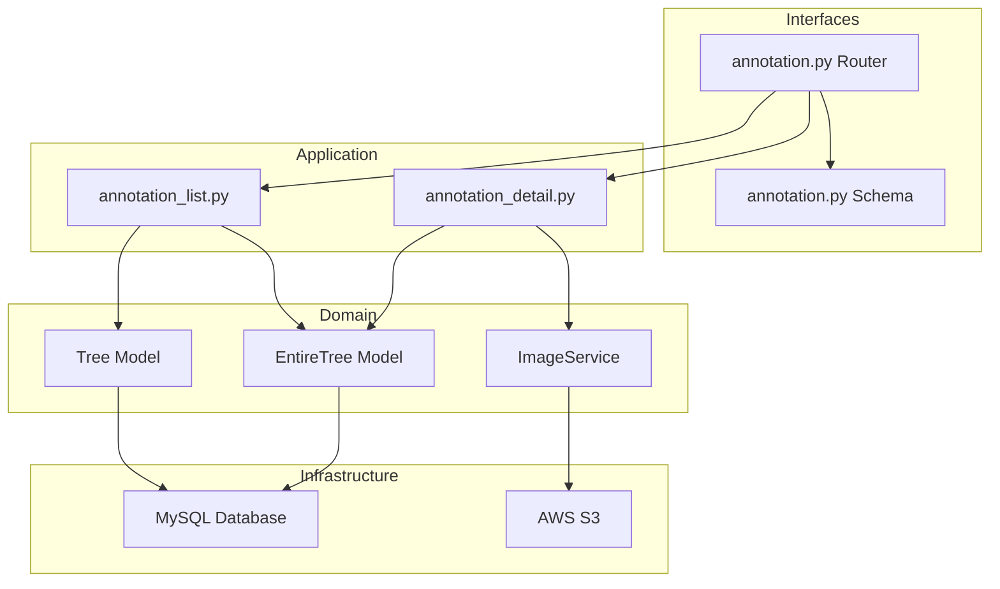
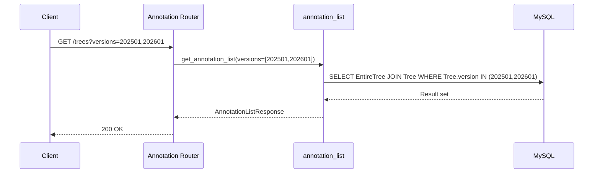
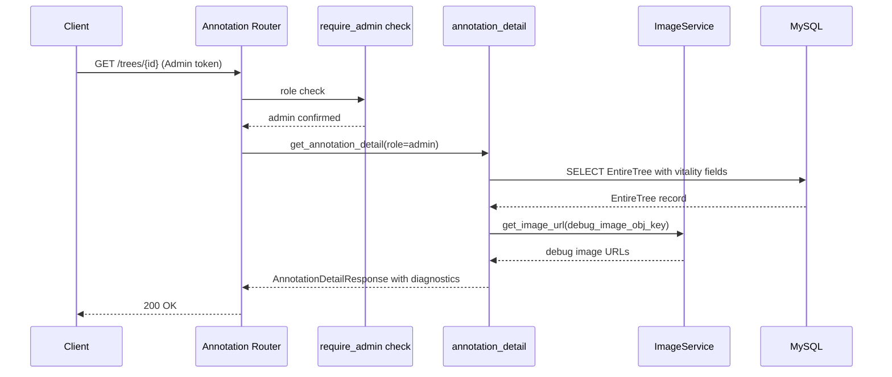
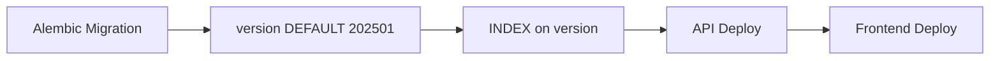

# Technical Design: annotation-version-diagnostics

## Overview

**Purpose**: アノテーション機能を拡張し、年度バージョンによるデータ区別・フィルタ、開花段階日表示、Admin向け診断値・デバッグ画像表示を実現する。
**Users**: アノテーター（年度フィルタ・開花段階日）、Adminユーザー（診断値・元気度フィルタ・デバッグ画像）。
**Impact**: Treeモデルへのversionカラム追加、アノテーションAPIの一覧・詳細レスポンス拡張。

### Goals
- Treeテーブルにversionカラムを追加し年度区別を可能にする
- アノテーション一覧にversionフィルタ、詳細に開花段階日を追加する
- Admin限定で診断値表示・元気度フィルタ・デバッグ画像URLを提供する

### Non-Goals
- version値の自動判定ロジック（固定値`202601`を使用）
- デバッグ画像のS3アップロード処理（既存Lambda処理の範囲）

## Architecture

### Existing Architecture Analysis

既存アノテーションシステムはレイヤードアーキテクチャに従う:
- **Interfaces**: `annotation.py`（FastAPIルーター）、`annotation.py`（Pydanticスキーマ）
- **Application**: `annotation_list.py`、`annotation_detail.py`、`save_annotation.py`
- **Domain**: `models.py`（Tree/EntireTree）、`image_service.py`、`bloom_state_service.py`
- **Infrastructure**: `database.py`（セッション管理）

本拡張は全レイヤーを横断するが、既存パターンに沿った最小限の変更で実現する。

### Architecture Pattern & Boundary Map



**Architecture Integration**:
- Selected pattern: 既存レイヤードアーキテクチャを踏襲
- Domain boundaries: Tree/EntireTreeモデル変更、スキーマ拡張
- Existing patterns preserved: JOIN+フィルタパターン、`require_admin`依存性注入、ImageServiceによるURL生成
- New components rationale: 新規コンポーネント不要、既存ファイルの拡張のみ

### Technology Stack

| Layer | Choice / Version | Role in Feature | Notes |
|-------|------------------|-----------------|-------|
| Backend | FastAPI 0.115 / Python 3.12 | APIエンドポイント拡張 | 既存 |
| ORM | SQLAlchemy 2.0 | Treeモデルversionカラム追加 | Mapped型 |
| Database | MySQL 8.0 | versionカラム格納・インデックス | Alembicマイグレーション |
| Migration | Alembic | スキーマ変更 | version INTEGER DEFAULT 202501 |

## System Flows

### 年度フィルタ付き一覧取得フロー



### Admin向け詳細取得フロー



## Requirements Traceability

| Requirement | Summary | Components | Interfaces | Flows |
|-------------|---------|------------|------------|-------|
| 1.1 | Treeにversionカラム追加 | Tree Model, Alembic Migration | - | - |
| 1.2 | 既存レコードデフォルト202501 | Alembic Migration | - | - |
| 1.3 | 新規作成時version=202601 | Tree Model | - | - |
| 2.1 | 年度チェックボックスUI提供 | - | AnnotationListItemResponse | 一覧取得 |
| 2.2 | 2025年度フィルタ | annotation_list | GET /trees?versions= | 一覧取得 |
| 2.3 | 2026年度フィルタ | annotation_list | GET /trees?versions= | 一覧取得 |
| 2.4 | 両方選択時 | annotation_list | GET /trees?versions= | 一覧取得 |
| 2.5 | 未選択時は全件表示 | annotation_list | GET /trees | 一覧取得 |
| 3.1 | bloom_30_date/bloom_50_date表示 | annotation_detail | AnnotationDetailResponse | 詳細取得 |
| 3.2 | 未記録時は空欄 | annotation_detail | AnnotationDetailResponse | 詳細取得 |
| 4.1 | Admin向け診断値表示 | annotation_detail | AnnotationDetailResponse | Admin詳細取得 |
| 4.2 | 非Admin非表示 | annotation_detail | AnnotationDetailResponse | 詳細取得 |
| 4.3 | EntireTreeから診断値取得 | annotation_detail | - | Admin詳細取得 |
| 5.1 | Admin向け推論モデルvitalityフィルタ | annotation_list | GET /trees?model_vitality= | 一覧取得 |
| 5.2 | 推論モデルvitality値一致フィルタ | annotation_list | GET /trees?model_vitality= | 一覧取得 |
| 5.3 | 非Admin非表示 | annotation_list | - | - |
| 6.1 | Admin向けデバッグ画像リンク | annotation_detail | AnnotationDetailResponse | Admin詳細取得 |
| 6.2 | 別画面でセグメンテーション画像表示 | annotation_detail, ImageService | AnnotationDetailResponse | Admin詳細取得 |
| 6.3 | 画像非存在時のメッセージ | annotation_detail | AnnotationDetailResponse | Admin詳細取得 |
| 6.4 | 非Admin非表示 | annotation_detail | AnnotationDetailResponse | 詳細取得 |

## Components and Interfaces

| Component | Domain/Layer | Intent | Req Coverage | Key Dependencies | Contracts |
|-----------|--------------|--------|--------------|------------------|-----------|
| Tree Model | Domain | versionカラム追加 | 1.1, 1.2, 1.3 | MySQL (P0) | - |
| Alembic Migration | Infrastructure | スキーマ変更 | 1.1, 1.2 | Alembic (P0) | - |
| annotation_list | Application | versionフィルタ追加 | 2.1-2.5, 5.1-5.3 | Tree Model (P0) | API |
| annotation_detail | Application | 開花日・診断値・デバッグ画像追加 | 3.1-3.2, 4.1-4.3, 6.1-6.4 | EntireTree (P0), ImageService (P1) | API |
| Annotation Schemas | Interfaces | レスポンス拡張 | 全要件 | Pydantic (P0) | API |
| Annotation Router | Interfaces | パラメータ・レスポンス追加 | 全要件 | annotation_list (P0), annotation_detail (P0) | API |

### Domain Layer

#### Tree Model 拡張

| Field | Detail |
|-------|--------|
| Intent | Treeテーブルにversionカラムを追加し年度区別を可能にする |
| Requirements | 1.1, 1.2, 1.3 |

**Responsibilities & Constraints**
- `version` INTEGER カラムをTreeモデルに追加（デフォルト値: `202501`）
- INTEGER型を採用（将来的に`version >= 202601`のような範囲クエリに対応）
- インデックス追加（フィルタクエリの高速化）

**Contracts**: API [ ]

**Implementation Notes**
- `version: Mapped[int] = mapped_column(Integer, default=202501, server_default=text("202501"), index=True)`
- Alembicマイグレーション: `op.add_column('trees', sa.Column('version', sa.Integer, server_default='202501', nullable=False))`
- 新規Tree作成時に`version=202601`を設定する箇所は、Tree作成のアプリケーション層で制御

### Application Layer

#### annotation_list 拡張

| Field | Detail |
|-------|--------|
| Intent | versionフィルタと一覧レスポンスへのversion情報追加 |
| Requirements | 2.1, 2.2, 2.3, 2.4, 2.5, 5.1, 5.2, 5.3 |

**Responsibilities & Constraints**
- `versions`パラメータ（Optional[list[int]]）によるフィルタリング
- `Tree.version IN (versions)`条件をクエリに追加
- versionsが空またはNoneの場合はフィルタなし（全件表示）
- 一覧レスポンスの各アイテムにversion値を含める
- 統計情報にversion別集計を追加（任意）
- Admin限定: `model_vitality`パラメータ（Optional[int]）による`EntireTree.vitality`フィルタリング
  - 既存の`vitality_value`フィルタ（`VitalityAnnotation.vitality_value`）はアノテーション結果に対するフィルタであり別物
  - `model_vitality`は推論モデルが算出した`EntireTree.vitality`でフィルタする

**Dependencies**
- Inbound: Annotation Router — パラメータ受け渡し (P0)
- Outbound: Tree Model — versionカラム参照 (P0)

**Contracts**: API [x]

##### API Contract

| Method | Endpoint | Request | Response | Errors |
|--------|----------|---------|----------|--------|
| GET | /trees | versions (query, optional, カンマ区切り), model_vitality (query, optional, Admin限定) | AnnotationListResponse (version含む) | 400 |

- `versions`パラメータ例: `?versions=202501` / `?versions=202501,202601` / 省略時全件
- 既存の`bloom_status`パラメータと同じカンマ区切りパターンを踏襲
- `model_vitality`パラメータ例: `?model_vitality=3` — Admin限定、`EntireTree.vitality`でフィルタ
  - 既存の`vitality_value`パラメータ（`VitalityAnnotation.vitality_value`、アノテーション結果）とは別フィールド

**Implementation Notes**
- 既存フィルタチェーン（`annotation_list.py:122-190`）にversion条件を追加
- `model_vitality`フィルタはAdmin限定: `EntireTree.vitality == model_vitality`条件を追加（roleチェック付き）
- 既存の`vitality_value`フィルタ（アノテーション結果）はそのまま維持

#### annotation_detail 拡張

| Field | Detail |
|-------|--------|
| Intent | 開花段階日・診断値・デバッグ画像URLをレスポンスに追加 |
| Requirements | 3.1, 3.2, 4.1, 4.2, 4.3, 6.1, 6.2, 6.3, 6.4 |

**Responsibilities & Constraints**
- EntireTreeの`bloom_30_date`/`bloom_50_date`をレスポンスに含める（全ロール共通）
- Adminロール時のみ以下を追加:
  - 診断値フィールド（vitality系9項目）
  - デバッグ画像URL（`debug_image_obj_key`/`debug_image_obj2_key`からURL生成）
- roleは`get_current_annotator()`から取得

**Dependencies**
- Inbound: Annotation Router — annotatorオブジェクト受け渡し (P0)
- Outbound: EntireTree Model — 診断値・bloom日・debug画像キー参照 (P0)
- Outbound: ImageService — デバッグ画像URL生成 (P1)

**Contracts**: API [x]

##### API Contract

| Method | Endpoint | Request | Response | Errors |
|--------|----------|---------|----------|--------|
| GET | /trees/{entire_tree_id} | - | AnnotationDetailResponse (拡張版) | 404 |

レスポンス追加フィールド（全ロール）:
- `bloom_30_date`: Optional[str] — 3分咲き日（ISO format）
- `bloom_50_date`: Optional[str] — 5分咲き日（ISO format）

レスポンス追加フィールド（Adminのみ、非Admin時はnull）:
- `diagnostics`: Optional[DiagnosticsResponse] — 診断値オブジェクト
- `debug_images`: Optional[DebugImagesResponse] — デバッグ画像URLオブジェクト

**Implementation Notes**
- `annotation_detail.py`の`get_annotation_detail()`にAnnotatorオブジェクトを渡し、role判定を行う
- デバッグ画像URLはEntireTreeの`debug_image_obj_key`/`debug_image_obj2_key`がNoneでなければImageServiceで生成
- bloom_30_date/bloom_50_dateはEntireTreeから直接取得（FloweringDateServiceは不要）

### Interfaces Layer

#### Annotation Schemas 拡張

| Field | Detail |
|-------|--------|
| Intent | レスポンススキーマに新規フィールド・サブモデルを追加 |
| Requirements | 全要件 |

**Contracts**: API [x]

##### 新規スキーマ定義

```python
class DiagnosticsResponse(BaseModel):
    """Admin向け診断値レスポンス"""
    vitality: Optional[int] = None
    vitality_noleaf: Optional[int] = None
    vitality_noleaf_weight: Optional[float] = None
    vitality_bloom: Optional[int] = None
    vitality_bloom_weight: Optional[float] = None
    vitality_bloom_30: Optional[int] = None
    vitality_bloom_30_weight: Optional[float] = None
    vitality_bloom_50: Optional[int] = None
    vitality_bloom_50_weight: Optional[float] = None

class DebugImagesResponse(BaseModel):
    """Admin向けデバッグ画像URLレスポンス"""
    noleaf_url: Optional[str] = None
    bloom_url: Optional[str] = None
```

##### 既存スキーマ拡張

```python
# AnnotationListItemResponse に追加
class AnnotationListItemResponse(BaseModel):
    # ... 既存フィールド ...
    version: int  # 追加: Tree.version（INTEGER、YYYYVV形式）

# AnnotationDetailResponse に追加
class AnnotationDetailResponse(BaseModel):
    # ... 既存フィールド ...
    bloom_30_date: Optional[str] = None      # 追加: 3分咲き日
    bloom_50_date: Optional[str] = None      # 追加: 5分咲き日
    diagnostics: Optional[DiagnosticsResponse] = None  # 追加: Admin限定
    debug_images: Optional[DebugImagesResponse] = None  # 追加: Admin限定
```

#### Annotation Router 拡張

| Field | Detail |
|-------|--------|
| Intent | versionsクエリパラメータ追加・レスポンス構築ロジック拡張 |
| Requirements | 2.1-2.5 |

**Implementation Notes**
- `GET /trees`に`versions: Optional[str] = Query(None)`パラメータを追加
- パラメータ解析: カンマ区切り文字列→`list[int]`変換（`bloom_status`と同パターン）
- `GET /trees`に`model_vitality: Optional[int] = Query(None)`パラメータを追加（Admin限定）
- 詳細エンドポイントに`annotator`オブジェクトを`get_annotation_detail()`に渡す

## Data Models

### Physical Data Model

#### trees テーブル変更

```sql
ALTER TABLE trees ADD COLUMN version INTEGER NOT NULL DEFAULT 202501;
CREATE INDEX ix_trees_version ON trees (version);
```

| Column | Type | Default | Nullable | Index | Notes |
|--------|------|---------|----------|-------|-------|
| version | INTEGER | 202501 | NO | YES | 年度バージョン（YYYYVV形式、将来的に範囲クエリ対応） |

#### entire_trees テーブル（変更なし）

診断値カラム・bloom日カラム・debug画像キーは全て既存。スキーマ変更不要。

### Data Contracts & Integration

**API Data Transfer**

一覧レスポンス拡張:
```json
{
  "items": [
    {
      "entire_tree_id": 1,
      "version": 202501,
      "...": "既存フィールド"
    }
  ]
}
```

詳細レスポンス拡張（Admin時）:
```json
{
  "entire_tree_id": 1,
  "bloom_30_date": "2026-04-01",
  "bloom_50_date": "2026-04-03",
  "diagnostics": {
    "vitality": 3,
    "vitality_noleaf": 4,
    "vitality_noleaf_weight": 0.8,
    "vitality_bloom": 2,
    "vitality_bloom_weight": 0.6,
    "vitality_bloom_30": 3,
    "vitality_bloom_30_weight": 0.5,
    "vitality_bloom_50": 4,
    "vitality_bloom_50_weight": 0.7
  },
  "debug_images": {
    "noleaf_url": "https://example.com/sakura_camera/media/trees/entire_debug_noleaf_xxx.jpg",
    "bloom_url": "https://example.com/sakura_camera/media/trees/entire_debug_bloom_xxx.jpg"
  }
}
```

詳細レスポンス（非Admin時）:
```json
{
  "entire_tree_id": 1,
  "bloom_30_date": "2026-04-01",
  "bloom_50_date": "2026-04-03",
  "diagnostics": null,
  "debug_images": null
}
```

## Error Handling

### Error Categories and Responses

**User Errors (4xx)**:
- `versions`パラメータに不正な値（非整数値）→ 400 Bad Request
- 存在しない`entire_tree_id` → 404 Not Found（既存ハンドリング）
- 非Adminがadmin限定フィルタ使用 → フィルタ無視（エラーは返さない）

**System Errors (5xx)**:
- デバッグ画像URL生成失敗 → nullを返却（画像非存在として扱う）

## Testing Strategy

### Unit Tests
- Tree Model: versionカラムのデフォルト値検証
- versions パラメータのパース処理（カンマ区切り→リスト変換）
- DiagnosticsResponse / DebugImagesResponse スキーマのシリアライズ
- Admin/非Adminでのレスポンスフィールド有無

### Integration Tests
- `GET /trees?versions=202501` → version=202501のtreeのみ返却
- `GET /trees?versions=202501,202601` → 両方のversionを返却
- `GET /trees` (versionsなし) → 全件返却
- `GET /trees/{id}` (Admin) → diagnostics/debug_images含む
- `GET /trees/{id}` (annotator) → diagnostics/debug_images=null
- `GET /trees/{id}` → bloom_30_date/bloom_50_date含む

### Migration
- Alembicマイグレーション適用後、既存treesレコードのversion=202501確認

## Migration Strategy



1. **Phase 1**: Alembicマイグレーション実行（versionカラム追加、デフォルト202501、インデックス作成）
2. **Phase 2**: APIデプロイ（後方互換: versionsパラメータはOptional、レスポンスにversionフィールド追加）
3. **Phase 3**: フロントエンドデプロイ（チェックボックスUI追加）

ロールバック: versionカラムのDROPで対応可能（APIはversionsパラメータ無視で動作継続）

## フロントエンド設計

### 技術スタック

| Layer | Choice / Version | Role |
|-------|------------------|------|
| Framework | React 18.2 + TypeScript | コンポーネントベースUI |
| Styling | Tailwind CSS 3.4 | ユーティリティファーストCSS |
| Routing | React Router DOM 6.21 | SPA ルーティング |
| Build | Vite 5 | 開発サーバー・ビルド |

### 変更対象ファイル

| ファイル | 変更内容 | 要件 |
|---------|---------|------|
| `types/api.ts` | 型定義追加（version, diagnostics, debug_images, ListFilter拡張） | 全要件 |
| `api/client.ts` | APIクライアントにversions, model_vitalityパラメータ送信を追加 | 2, 5 |
| `pages/ListPage.tsx` | 年度チェックボックス、model_vitalityフィルタ、versionバッジ追加 | 2, 5 |
| `pages/AnnotationPage.tsx` | bloom日表示、診断値セクション、デバッグ画像リンク追加 | 3, 4, 6 |

### 型定義拡張（types/api.ts）

```typescript
// AnnotationListItem に追加
export interface AnnotationListItem {
  // ... 既存フィールド ...
  version: number;  // 追加: Tree.version
}

// AnnotationDetail に追加
export interface AnnotationDetail {
  // ... 既存フィールド ...
  bloom_30_date: string | null;      // 追加: 3分咲き日
  bloom_50_date: string | null;      // 追加: 5分咲き日
  diagnostics: Diagnostics | null;   // 追加: Admin限定
  debug_images: DebugImages | null;  // 追加: Admin限定
}

// 新規インターフェース
export interface Diagnostics {
  vitality: number | null;
  vitality_noleaf: number | null;
  vitality_noleaf_weight: number | null;
  vitality_bloom: number | null;
  vitality_bloom_weight: number | null;
  vitality_bloom_30: number | null;
  vitality_bloom_30_weight: number | null;
  vitality_bloom_50: number | null;
  vitality_bloom_50_weight: number | null;
}

export interface DebugImages {
  noleaf_url: string | null;
  bloom_url: string | null;
}

// ListFilter に追加
export interface ListFilter {
  // ... 既存フィールド ...
  versions: string | null;         // 追加: カンマ区切り ("202501,202601")
  model_vitality: number | null;   // 追加: Admin限定
}
```

### 一覧画面（ListPage.tsx）設計

#### 年度チェックボックス（Req 2.1-2.5）

フィルタセクションに年度チェックボックスを追加する。

- `2025年度`、`2026年度` のチェックボックスを配置
- 複数選択可能（チェックボックス方式）
- URLパラメータ `versions` にカンマ区切りで保持（例: `versions=202501,202601`）
- 未選択時はパラメータを送信しない（全件表示）
- 既存の `updateFilter` パターンではなく、チェックボックスの組み合わせを管理する独自ハンドラを使用

```
フィルターUI配置:
[全て|入力済み|未入力] [全て|準備完了|未準備(admin)] [都道府県▼]
[撮影日: ____〜____] [元気度▼(入力済時)] [開花状態▼]
[☑2025年度 ☑2026年度] [推論モデル元気度▼(admin)]
```

#### model_vitalityフィルタ（Req 5.1-5.3, Admin限定）

- Admin限定のドロップダウンフィルタ
- EntireTree.vitalityの値（1-5）で絞り込み
- 既存の `vitality_value` フィルタ（アノテーション結果）とは別
- ラベル: 「推論モデル元気度」

#### versionバッジ（カード表示）

- 各カードの左下にバージョンバッジを表示
- 2025年度: `bg-blue-100 text-blue-700`
- 2026年度: `bg-emerald-100 text-emerald-700`

### 詳細画面（AnnotationPage.tsx）設計

#### 開花段階日表示（Req 3.1-3.2）

撮影情報カードに `bloom_30_date`（3分咲き日）と `bloom_50_date`（5分咲き日）を追加する。

- 開花日と満開開始日の間に配置
- nullの場合は`-`を表示
- `formatDateShort` を使って `M/D` 形式で表示
- 全ロール共通で表示

#### 診断値セクション（Req 4.1-4.3, Admin限定）

撮影情報カードの下に新しいカードとして配置する。

- タイトル: 「診断値（推論モデル）」
- vitality系9項目をキー・バリュー形式で表示
- nullの場合は`-`を表示
- weight値は小数点2桁で表示
- `isAdmin && detail.diagnostics` で条件レンダリング

```
┌─ 診断値（推論モデル）──────────┐
│ 元気度              3          │
│ 花なし元気度         4          │
│ 花なし重み           0.80       │
│ 開花元気度           2          │
│ 開花重み             0.60       │
│ 3分咲き元気度        3          │
│ 3分咲き重み          0.50       │
│ 5分咲き元気度        4          │
│ 5分咲き重み          0.70       │
└────────────────────────────────┘
```

#### デバッグ画像リンク（Req 6.1-6.4, Admin限定）

診断値セクションの下に配置する。

- タイトル: 「デバッグ画像」
- `noleaf_url` / `bloom_url` が存在する場合はリンク（`target="_blank"`で別タブ表示）
- 画像が存在しない場合は「画像なし」テキスト
- `isAdmin && detail.debug_images` で条件レンダリング

```
┌─ デバッグ画像──────────────────┐
│ 花なし: [画像を表示↗]          │
│ 開花:   [画像を表示↗]          │
└────────────────────────────────┘
```

### APIクライアント（client.ts）設計

#### getTrees 拡張

```typescript
// 既存のフィルタ送信に追加
if (filter.versions) params.append('versions', filter.versions);
if (filter.model_vitality !== undefined && filter.model_vitality !== null) {
  params.append('model_vitality', String(filter.model_vitality));
}
```

#### getTreeDetail 拡張

```typescript
// ナビゲーション維持用にversions, model_vitalityを送信
if (filter.versions) params.append('versions', filter.versions);
if (filter.model_vitality !== undefined && filter.model_vitality !== null) {
  params.append('model_vitality', String(filter.model_vitality));
}
```

### URL状態管理

一覧画面のフィルタ状態はURLパラメータで管理する（既存パターン踏襲）。

| パラメータ | 型 | 例 | 用途 |
|-----------|---|---|------|
| `versions` | string (カンマ区切り) | `202501,202601` | 年度フィルタ |
| `model_vitality` | string (数値) | `3` | 推論モデル元気度フィルタ（Admin） |

詳細画面へのナビゲーション時にこれらのパラメータも引き継ぐ（`handleItemClick`, `navigateTo`, `getBackUrl` を拡張）。
