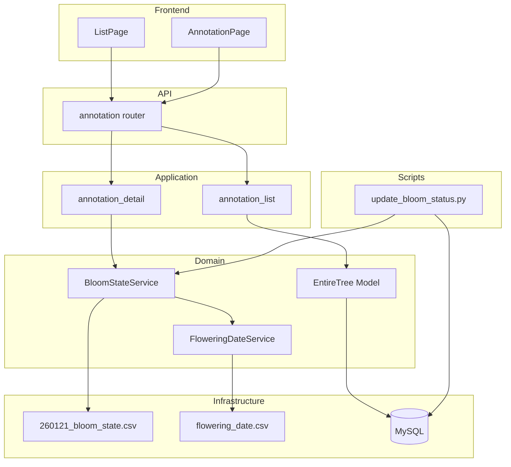
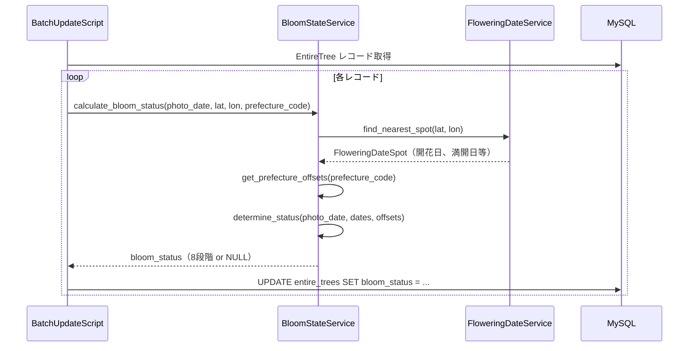
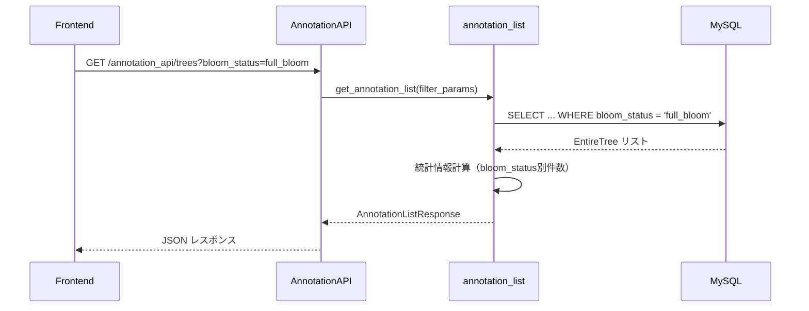
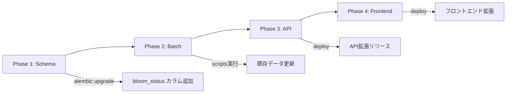

# Technical Design: bloom-status-filter

## Overview

**Purpose**: 桜の開花状態（bloom status）に基づくフィルタリング・表示機能をアノテーションツールに追加し、アノテーターが特定の開花状態の画像を効率的に選別・作業できるようにする。

**Users**:
- **アノテーター**: 特定の開花状態の画像に集中してアノテーション作業を行う
- **管理者（admin）**: 開花状態ごとの統計を確認し、アノテーション進捗を管理
- **運用担当者**: バッチスクリプトで既存データの bloom_status を更新

**Impact**: 既存の EntireTree テーブルに bloom_status カラムを追加し、アノテーションAPI・フロントエンドを拡張。

### Goals
- 8段階の開花状態（開花前、開花、3分咲き、5分咲き、8分咲き（満開）、散り始め、花＋若葉（葉桜）、葉のみ）を正確に判定
- 都道府県別のオフセット計算による地域差対応
- 高速なフィルタリング・ソートのためのインデックス付きカラム
- 既存UIパターンに沿った一貫性のあるフロントエンド拡張

### Non-Goals
- 開花予想CSVデータの自動更新機能
- 機械学習による開花状態推定
- リアルタイムの開花状態再計算（バッチ更新方式を採用）

## Architecture

### Existing Architecture Analysis
- **レイヤードアーキテクチャ**: `interfaces → application → domain ← infrastructure`
- **既存パターン**:
  - ドメインサービス: シングルトンパターン（`get_flowering_date_service()`）
  - APIエンドポイント: FastAPI Router + Pydantic スキーマ
  - フィルタリング: クエリパラメータ経由、ページネーション対応
  - フロントエンド: React + TypeScript、URLパラメータで状態管理
- **既存統合ポイント**:
  - `FloweringDateService`: 緯度経度から最寄りの開花予想地点を取得
  - `MunicipalityService`: 都道府県コードから都道府県名を取得
  - `VitalityAnnotation`: is_ready フラグ管理のパターン（先行実装）

### Architecture Pattern & Boundary Map



**Architecture Integration**:
- **Selected pattern**: 既存のレイヤードアーキテクチャを維持し、新規ドメインサービス（BloomStateService）を追加
- **Domain boundaries**: BloomStateService は開花状態計算の責務を持ち、FloweringDateService を利用
- **Existing patterns preserved**: シングルトンサービス、FastAPI Depends による DI
- **New components rationale**: BloomStateService は 260121_bloom_state.csv の読み込みとオフセット計算を担当
- **Steering compliance**: Python 3.12、SQLAlchemy 2.0 Mapped型、Pydantic 2.x を使用

### Technology Stack

| Layer | Choice / Version | Role in Feature | Notes |
|-------|------------------|-----------------|-------|
| Backend | Python 3.12 + FastAPI 0.115 | API拡張、サービス実装 | 既存スタック |
| ORM | SQLAlchemy 2.0 | EntireTree モデル拡張 | Mapped型使用 |
| Migration | Alembic | bloom_status カラム追加 | 既存パターン |
| Frontend | React 18 + TypeScript | UI拡張 | 既存パターン |
| Data | MySQL 8.0 | bloom_status インデックス | 既存DB |

## System Flows

### 開花状態計算フロー



### フィルタリングフロー



## Requirements Traceability

| Requirement | Summary | Components | Interfaces | Flows |
|-------------|---------|------------|------------|-------|
| 1.1-1.11 | 8段階ステータス判定ロジック | BloomStateService | - | 開花状態計算フロー |
| 1.12-1.13 | NULLケース処理 | BloomStateService | - | 開花状態計算フロー |
| 2.1-2.3 | EntireTree bloom_status カラム | EntireTree Model, Alembic Migration | - | - |
| 3.1-3.5 | バッチ更新スクリプト | BatchUpdateScript | CLI | 開花状態計算フロー |
| 4.1-4.4 | API フィルタリング・統計 | annotation_list, annotation.py | REST API | フィルタリングフロー |
| 5.1-5.3 | 詳細画面 bloom_status 表示 | annotation_detail | REST API | - |
| 6.1-6.5 | フロントエンド一覧画面 | ListPage | - | フィルタリングフロー |
| 7.1-7.2 | フロントエンド詳細画面 | AnnotationPage | - | - |

## Components and Interfaces

| Component | Domain/Layer | Intent | Req Coverage | Key Dependencies | Contracts |
|-----------|--------------|--------|--------------|------------------|-----------|
| BloomStateService | Domain/Service | 開花状態計算 | 1.1-1.13 | FloweringDateService (P0) | Service |
| EntireTree Model | Domain/Model | bloom_status カラム追加 | 2.1-2.3 | - | - |
| Alembic Migration | Infrastructure | スキーマ変更 | 2.3 | - | - |
| BatchUpdateScript | Scripts | 既存データ更新 | 3.1-3.5 | BloomStateService (P0), DB (P0) | Batch |
| annotation_list | Application | 一覧取得・統計 | 4.1-4.4 | EntireTree (P0) | - |
| annotation_detail | Application | 詳細取得 | 5.1-5.3 | BloomStateService (P1) | - |
| annotation.py (API) | Interfaces/API | エンドポイント拡張 | 4.1-4.4 | annotation_list (P0) | API |
| annotation.py (Schema) | Interfaces/Schema | レスポンス拡張 | 4.3-4.4 | - | - |
| ListPage | Frontend | 一覧画面拡張 | 6.1-6.5 | API (P0) | State |
| AnnotationPage | Frontend | 詳細画面拡張 | 7.1-7.2 | API (P0) | State |

### Domain Layer

#### BloomStateService

| Field | Detail |
|-------|--------|
| Intent | 撮影日・位置情報から8段階の開花状態を計算 |
| Requirements | 1.1, 1.2, 1.3, 1.4, 1.5, 1.6, 1.7, 1.8, 1.9, 1.10, 1.11, 1.12, 1.13 |

**Responsibilities & Constraints**
- 260121_bloom_state.csv の読み込みと都道府県別オフセット値の管理
- FloweringDateService と連携した開花予想日取得
- 8段階ステータスの判定ロジック実装
- シングルトンパターンでインスタンス管理

**Dependencies**
- Outbound: FloweringDateService — 開花予想日・満開開始日・満開終了日取得 (P0)
  - `find_nearest_spot()` は開花日、満開開始日、満開終了日を含む `FloweringDateSpot` を返す（既存実装で AnnotationPage に表示済み）
- External: 260121_bloom_state.csv — 都道府県別ステータス開始日 (P0)

**260121_bloom_state.csv カラム構造**
```
カラム0: No.（都道府県コード "01"-"47"）
カラム1: 都道府県名＋代表地点名（例: "北海道函館市"）
カラム2: 開花開始日
カラム3: 3分咲き開始日
カラム4: 5分咲き開始日
カラム5: 8分咲き（満開）開始日
カラム6: 散り始め開始日
カラム7: 花＋若葉（葉桜）開始日
カラム8: 葉のみ開始日
カラム9: 摘要
```
- ヘッダー: 1-2行目（スキップ対象）
- 3行目: 例示行（"例" で始まる、スキップ対象）
- 4行目以降: データ行
- 日付形式: `M月D日`（例: "4月21日"）→ 年度は撮影日から推定
- 沖縄県（47）: 全フィールドが `-` → NULL 返却ケース

**Contracts**: Service [x]

##### Service Interface

```python
from dataclasses import dataclass
from datetime import date
from typing import Literal, Optional

# DB保存用の英語キー
BloomStatus = Literal[
    "before_bloom", "blooming", "30_percent", "50_percent",
    "full_bloom", "falling", "with_leaves", "leaves_only"
]

# UI表示用マッピング（フロントエンド・API レスポンスで使用）
BLOOM_STATUS_LABELS: dict[str, str] = {
    "before_bloom": "開花前",
    "blooming": "開花",
    "30_percent": "3分咲き",
    "50_percent": "5分咲き",
    "full_bloom": "8分咲き（満開）",
    "falling": "散り始め",
    "with_leaves": "花＋若葉（葉桜）",
    "leaves_only": "葉のみ",
}

@dataclass
class PrefectureOffsets:
    """都道府県別オフセット値"""
    flowering_to_3bu: int  # 開花→3分咲きオフセット（日）
    flowering_to_5bu: int  # 開花→5分咲きオフセット（日）
    end_to_hanawakaba: int  # 満開終了→花＋若葉オフセット（日）
    end_to_hanomi: int  # 満開終了→葉のみオフセット（日）

class BloomStateService:
    def __init__(self) -> None:
        """260121_bloom_state.csv を読み込んで初期化"""
        ...

    def get_prefecture_offsets(
        self, prefecture_code: str
    ) -> Optional[PrefectureOffsets]:
        """
        都道府県コードからオフセット値を取得

        Returns:
            PrefectureOffsets or None（データがない場合）
        """
        ...

    def calculate_bloom_status(
        self,
        photo_date: date,
        latitude: float,
        longitude: float,
        prefecture_code: Optional[str],
    ) -> Optional[BloomStatus]:
        """
        開花状態を計算

        Args:
            photo_date: 撮影日
            latitude: 緯度
            longitude: 経度
            prefecture_code: 都道府県コード（Treeから取得）

        Returns:
            8段階の開花状態、または計算不能な場合 None

        Preconditions:
            - photo_date は有効な日付
            - latitude, longitude は有効な座標

        Postconditions:
            - 返り値は BloomStatus 型の8値のいずれか、または None
        """
        ...

def get_bloom_state_service() -> BloomStateService:
    """シングルトンインスタンスを取得"""
    ...
```

**Implementation Notes**
- Integration: FloweringDateService の `find_nearest_spot` を利用して開花予想日を取得
- Validation: prefecture_code が存在しない場合は None を返す
- Risks: CSVデータの不整合（日付パースエラー等）は警告ログを出力して該当行をスキップ

---

#### EntireTree Model 拡張

| Field | Detail |
|-------|--------|
| Intent | bloom_status カラムの追加 |
| Requirements | 2.1, 2.2 |

**Schema Changes**

```python
# app/domain/models/models.py に追加

class EntireTree(Base):
    # 既存カラム...

    bloom_status: Mapped[Optional[str]] = mapped_column(
        String(20),
        nullable=True,
        index=True,
        comment="開花状態（8段階 or NULL）"
    )
```

**Implementation Notes**
- Validation: 値の制約はアプリケーション層で実施（DB ENUMは避ける）

---

### Infrastructure Layer

#### Alembic Migration

| Field | Detail |
|-------|--------|
| Intent | bloom_status カラムとインデックスの追加 |
| Requirements | 2.3 |

**Contracts**: Batch [x]

##### Batch / Job Contract
- **Trigger**: `alembic upgrade head` 実行時
- **Input / validation**: なし（スキーマ変更のみ）
- **Output / destination**: entire_trees テーブルへのカラム追加
- **Idempotency & recovery**: Alembic のバージョン管理により担保

```python
# alembic/versions/xxx_add_bloom_status_to_entire_trees.py

def upgrade() -> None:
    op.add_column(
        'entire_trees',
        sa.Column('bloom_status', sa.String(20), nullable=True)
    )
    op.create_index(
        'idx_entire_trees_bloom_status',
        'entire_trees',
        ['bloom_status']
    )

def downgrade() -> None:
    op.drop_index('idx_entire_trees_bloom_status', 'entire_trees')
    op.drop_column('entire_trees', 'bloom_status')
```

---

### Scripts

#### BatchUpdateScript

| Field | Detail |
|-------|--------|
| Intent | 既存 EntireTree レコードの bloom_status 一括更新 |
| Requirements | 3.1, 3.2, 3.3, 3.4, 3.5 |

**Contracts**: Batch [x]

##### Batch / Job Contract
- **Trigger**: CLI 手動実行 (`python scripts/update_bloom_status.py`)
- **Input / validation**:
  - `--dry-run`: 実際の更新を行わず計算結果のみ表示
  - `--batch-size`: バッチサイズ指定（デフォルト: 1000）
- **Output / destination**: 標準出力に進捗表示、DB への UPDATE
- **Idempotency & recovery**: 冪等性あり（同じ入力で同じ結果）、中断後も再実行可能

```python
# scripts/update_bloom_status.py

import argparse
from app.domain.services.bloom_state_service import get_bloom_state_service
from app.infrastructure.database.database import get_db

def main():
    parser = argparse.ArgumentParser()
    parser.add_argument('--dry-run', action='store_true')
    parser.add_argument('--batch-size', type=int, default=1000)
    args = parser.parse_args()

    # 処理ロジック...
```

**Implementation Notes**
- Integration: SQLAlchemy セッションのバッチコミット
- Validation: エラー発生時はログ出力して処理継続
- Risks: 大量データ処理時のメモリ使用量（バッチサイズで制御）

---

### Application Layer

#### annotation_list 拡張

| Field | Detail |
|-------|--------|
| Intent | bloom_status フィルタリングと統計情報追加 |
| Requirements | 4.1, 4.2, 4.4 |

**Changes**

```python
# app/application/annotation/annotation_list.py

@dataclass
class AnnotationListFilter:
    # 既存フィールド...
    bloom_status_filter: list[str] | None = None  # 複数選択対応

@dataclass
class AnnotationStats:
    # 既存フィールド...
    bloom_status_counts: dict[str, int] = field(default_factory=dict)
    # キー: ステータス名, 値: { total: int, ready: int, annotated: int }
```

---

#### annotation_detail 拡張

| Field | Detail |
|-------|--------|
| Intent | bloom_status フィルター対応ナビゲーション |
| Requirements | 5.3 |

**Changes**

```python
# app/application/annotation/annotation_detail.py

@dataclass
class AnnotationListFilter:
    # 既存フィールド...
    bloom_status_filter: list[str] | None = None
```

---

### Interfaces Layer

#### annotation.py (API) 拡張

| Field | Detail |
|-------|--------|
| Intent | bloom_status クエリパラメータ追加 |
| Requirements | 4.1, 4.2 |

**Contracts**: API [x]

##### API Contract

| Method | Endpoint | Request | Response | Errors |
|--------|----------|---------|----------|--------|
| GET | /annotation_api/trees | bloom_status: Optional[str] (カンマ区切り) | AnnotationListResponse | 400 |
| GET | /annotation_api/trees/{id} | bloom_status: Optional[str] | AnnotationDetailResponse | 400, 403, 404 |

**Request Parameter**
```
bloom_status: str  # カンマ区切りで複数指定可能、DB保存用の英語キーを使用
# 例: "full_bloom,falling" または単一値 "full_bloom"
# 有効な値: before_bloom, blooming, 30_percent, 50_percent, full_bloom, falling, with_leaves, leaves_only
```

---

#### annotation.py (Schema) 拡張

| Field | Detail |
|-------|--------|
| Intent | レスポンススキーマの拡張 |
| Requirements | 4.3, 4.4 |

**Changes**

```python
# app/interfaces/schemas/annotation.py

class AnnotationListItemResponse(BaseModel):
    # 既存フィールド...
    bloom_status: Optional[str] = Field(None, description="開花状態")

class BloomStatusStats(BaseModel):
    """開花状態別統計"""
    status: str = Field(..., description="開花状態名")
    total_count: int = Field(..., description="総件数")
    ready_count: int = Field(..., description="準備完了件数")
    annotated_count: int = Field(..., description="アノテーション完了件数")

class AnnotationStatsResponse(BaseModel):
    # 既存フィールド...
    bloom_status_stats: list[BloomStatusStats] = Field(
        default_factory=list,
        description="開花状態別統計"
    )
```

---

### Frontend

#### ListPage 拡張

| Field | Detail |
|-------|--------|
| Intent | bloom_status フィルターと統計表示追加 |
| Requirements | 6.1, 6.2, 6.3, 6.4, 6.5 |

**Contracts**: State [x]

##### State Management
- **State model**: `bloomStatusFilter: string[]` を追加（URLパラメータと同期）
- **Persistence**: URLパラメータ `bloom_status` で永続化
- **Concurrency strategy**: 既存パターン（楽観的更新）を踏襲

**UI Changes**
- フィルターエリアに開花状態ドロップダウン（複数選択可）を追加
- 統計情報エリアに開花状態別件数を追加
- 各画像サムネイルに bloom_status バッジを表示

**Implementation Notes**
- Integration: 既存の `updateFilter` 関数を拡張
- Validation: 不明なステータス値は「未設定」として表示

---

#### AnnotationPage 拡張

| Field | Detail |
|-------|--------|
| Intent | bloom_status 表示の色分け強化 |
| Requirements | 7.1, 7.2 |

**UI Changes**
- 既存の `getBloomStatusStyle` 関数を8段階対応に拡張
- 「開花」「8分咲き（満開）」「花＋若葉（葉桜）」「葉のみ」の色を追加

```typescript
// DB値 → UI表示ラベル
const BLOOM_STATUS_LABELS: Record<string, string> = {
  before_bloom: "開花前",
  blooming: "開花",
  "30_percent": "3分咲き",
  "50_percent": "5分咲き",
  full_bloom: "8分咲き（満開）",
  falling: "散り始め",
  with_leaves: "花＋若葉（葉桜）",
  leaves_only: "葉のみ",
};

// DB値 → スタイルクラス
const getBloomStatusStyle = (status: string | null): string => {
  switch (status) {
    case "before_bloom": return "bg-gray-100 text-gray-700";
    case "blooming": return "bg-pink-50 text-pink-600";
    case "30_percent": return "bg-pink-100 text-pink-700";
    case "50_percent": return "bg-pink-200 text-pink-800";
    case "full_bloom": return "bg-pink-500 text-white";
    case "falling": return "bg-orange-100 text-orange-700";
    case "with_leaves": return "bg-lime-100 text-lime-700";
    case "leaves_only": return "bg-green-100 text-green-700";
    default: return "bg-gray-50 text-gray-500";
  }
};

// 表示時は BLOOM_STATUS_LABELS[status] で日本語ラベルを取得
```

## Data Models

### Domain Model

**Aggregates**:
- EntireTree（集約ルート）: 撮影情報 + bloom_status
- VitalityAnnotation: アノテーション作業情報（is_ready, vitality_value）

**Value Objects**:
- BloomStatus: 8段階の開花状態を表す英語キー（DB保存用）
- PrefectureOffsets: 都道府県別オフセット値

**Business Rules**:
- bloom_status は photo_date, latitude, longitude, prefecture_code から算出
- 開花予想日・満開予想日が取得できない場合は NULL
- 260121_bloom_state.csv にない都道府県は NULL

**BloomStatus 値マッピング**:

| DB値（英語） | UI表示（日本語） |
|-------------|-----------------|
| `before_bloom` | 開花前 |
| `blooming` | 開花 |
| `30_percent` | 3分咲き |
| `50_percent` | 5分咲き |
| `full_bloom` | 8分咲き（満開） |
| `falling` | 散り始め |
| `with_leaves` | 花＋若葉（葉桜） |
| `leaves_only` | 葉のみ |

### Physical Data Model

**Table: entire_trees**

| Column | Type | Nullable | Index | Notes |
|--------|------|----------|-------|-------|
| bloom_status | VARCHAR(20) | YES | idx_entire_trees_bloom_status | 新規追加 |

**Index**:
- `idx_entire_trees_bloom_status`: bloom_status フィルタリング高速化

## Error Handling

### Error Categories and Responses

**User Errors (4xx)**:
- 400: 無効な bloom_status パラメータ値 → エラーメッセージで有効な値を提示

**Business Logic Errors (422)**:
- bloom_status 計算不可 → NULL として扱い、UIで「未設定」表示

### Monitoring
- BloomStateService の CSV 読み込みエラー → loguru で WARNING 出力
- バッチスクリプトの処理件数・エラー件数 → 標準出力に表示

## Testing Strategy

### Unit Tests
- BloomStateService: 8段階ステータス判定ロジック（各境界条件）
- PrefectureOffsets 計算: CSV データからのオフセット抽出
- NULL ケース: 開花予想日なし、都道府県データなし

### Integration Tests
- API フィルタリング: bloom_status パラメータによる絞り込み
- 統計情報: bloom_status 別件数の正確性
- ナビゲーション: bloom_status フィルター適用時の前後移動

### E2E/UI Tests
- 一覧画面: bloom_status ドロップダウン操作、バッジ表示
- 詳細画面: bloom_status 色分け表示

## Migration Strategy



**Phase 1: Schema Migration**
- Alembic マイグレーション実行
- カラム追加のみ（データなし）

**Phase 2: Batch Update**
- `scripts/update_bloom_status.py` 実行
- ドライランで確認後、本番実行

**Phase 3: API Deployment**
- バックエンド拡張をデプロイ
- 既存エンドポイントは後方互換維持

**Phase 4: Frontend Deployment**
- フロントエンド拡張をデプロイ
- bloom_status フィルター・統計表示が有効化

**Rollback Triggers**:
- Phase 2: エラー率が10%を超えた場合 → バッチ中断、原因調査
- Phase 3/4: 重大なバグ発見 → 前バージョンにロールバック

**Validation Checkpoints**:
- Phase 2 後: bloom_status が NULL でないレコード数を確認
- Phase 3 後: API テストスイート実行
- Phase 4 後: E2E テスト実行
