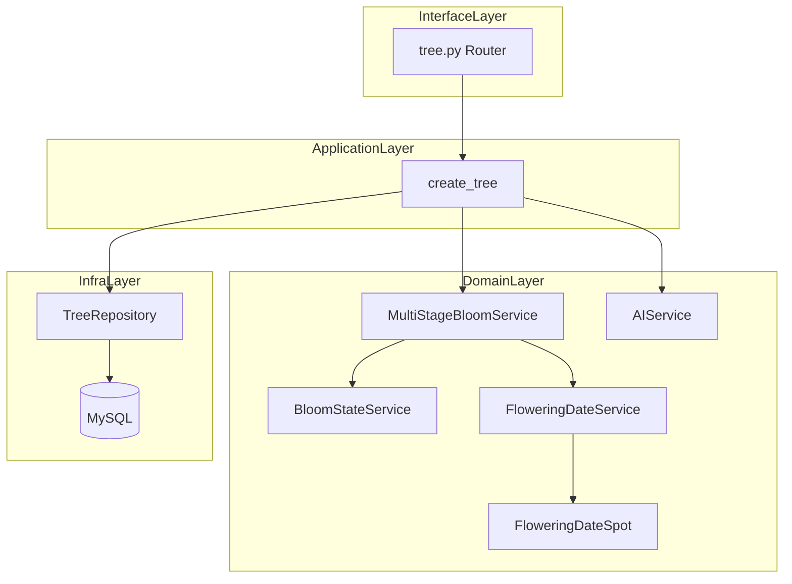
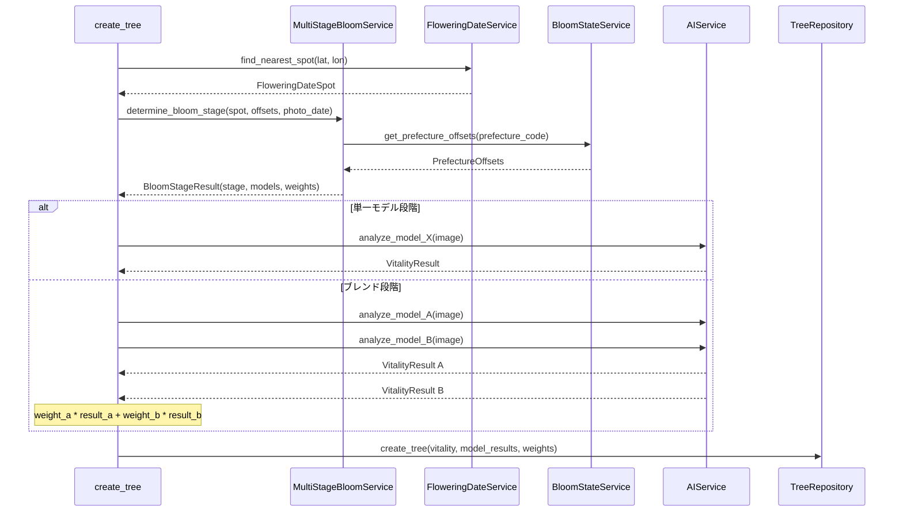
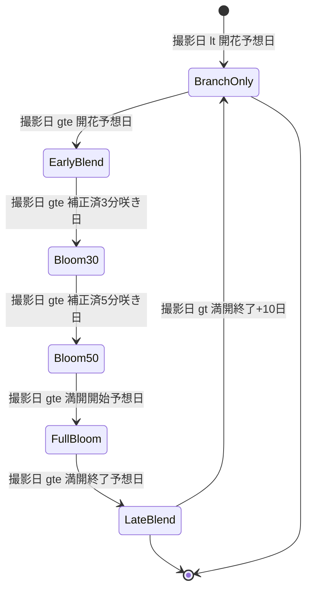

# 技術設計書: 多段階開花モデル（multi-stage-bloom-model）

## Overview

**目的**: `POST /sakura_camera/api/tree/entire` エンドポイントの樹勢判定ロジックを、従来の2モデルブレンド方式から4段階開花モデル選択方式へ拡張する。撮影場所と日時に基づき最適な AI モデルを選択し、樹勢診断の精度を向上させる。

**ユーザー**: 一般ユーザー（桜の写真投稿者）が本機能を利用する。API レスポンスの形式は変更なく、内部のモデル選択ロジックが高精度化される。

**影響**: 現行の `FloweringDateSpot.estimate_vitality()` による季節ベースの2モデルブレンドを、都道府県別オフセット補正による6段階の開花判定 + 条件付きモデル呼び出しに置き換える。フォールバック時は従来ロジックを維持する。

### ゴール
- 開花段階に基づく4モデル（枝のみ・3分咲き・5分咲き・満開）の適切な選択
- 都道府県別オフセットの比率補正による地域差の反映
- 遷移期間（開花ブレンド・満開後ブレンド）での線形ブレンドによる連続的な品質保証
- 判定根拠（使用モデル・重み・個別結果）の DB 保存

### 非ゴール
- AI モデル自体の精度改善（モデルは外部提供）
- API レスポンススキーマの変更
- 既存レコードのバックフィル（既存データは NULL のまま）
- 散り始め・花＋若葉・葉のみの段階での個別モデル対応（枝のみモデルで代替）

## Architecture

> 詳細なディスカバリーノートは `research.md` を参照。設計判断はすべて本ドキュメントに記載。

### 既存アーキテクチャ分析

- **現行パターン**: `create_tree` → 常に noleaf + bloom の2モデル並列呼び出し → `FloweringDateSpot.estimate_vitality()` で重みを算出 → ブレンド
- **既存ドメイン境界**: `BloomStateService`（8段階状態判定）と `FloweringDateSpot.estimate_vitality()`（2モデル重み算出）は独立
- **維持すべき統合ポイント**: AI API の REST インターフェース、`TreeRepository.create_tree()` のシグネチャ拡張、`EntireTree` モデル
- **対応する技術的負債**: `estimate_vitality()` の固定5日フォールオフは要件の10日間に拡張

### Architecture Pattern & Boundary Map



**アーキテクチャ統合**:
- 選択パターン: レイヤードアーキテクチャ（既存踏襲）+ 新規ドメインサービス追加
- ドメイン境界: `MultiStageBloomService` が開花段階判定・オフセット補正・モデル選択を一元管理。`AIService` はモデル呼び出しのみに集中
- 既存パターン保持: シングルトンファクトリ（`get_xxx_service()`）、`asyncio.gather` による並列 API 呼び出し、`TreeRepository` 経由の DB 保存
- 新コンポーネントの理由: 多段階判定ロジックは `calculate_bloom_status`（8段階表示用）とも `estimate_vitality`（2モデル重み算出）とも異なる責務のため、新サービスとして分離
- ステアリング準拠: レイヤード依存方向（interfaces → application → domain ← infrastructure）を維持

### Technology Stack

| レイヤー | 選択 / バージョン | 本機能での役割 | 備考 |
|---------|------------------|---------------|------|
| バックエンド | Python 3.12 / FastAPI 0.115 | エンドポイント・オーケストレーション | 既存スタック |
| ドメインサービス | dataclass / Literal 型 | 開花段階の型安全な表現 | 新規追加 |
| ORM | SQLAlchemy 2.0 Mapped | EntireTree カラム追加 | 既存スタック |
| データベース | MySQL 8.0 | 判定結果保存 | ALTER TABLE |
| マイグレーション | Alembic | スキーマ変更 | 既存スタック |
| AI API | aiohttp | 新モデルエンドポイント呼び出し | 既存パターン踏襲 |

## System Flows

### 多段階モデル判定フロー



### 開花段階判定の状態遷移



**判定ロジック補足**:
- `EarlyBlend`（開花ブレンド）: noleaf と bloom_30 を線形補間。進行度 = `(撮影日 - 開花予想日) / (補正済3分咲き日 - 開花予想日)`
- `LateBlend`（満開後ブレンド）: bloom と noleaf を線形補間。進行度 = `(撮影日 - 満開終了日) / 10日`
- オフセット補正比率 = `(spot.full_bloom_date - spot.flowering_date).days / offsets.flowering_to_full_bloom`

## Requirements Traceability

| 要件 | 概要 | コンポーネント | インターフェース | フロー |
|------|------|---------------|-----------------|--------|
| 1.1 | 最寄りスポット取得 | FloweringDateService | find_nearest_spot() | 判定フロー Step 1 |
| 1.2 | 6段階開花判定 | MultiStageBloomService | determine_bloom_stage() | 状態遷移図 |
| 1.3 | オフセット補正適用 | MultiStageBloomService | determine_bloom_stage() | 判定フロー Step 2 |
| 1.4-1.10 | 各段階の判定条件 | MultiStageBloomService | determine_bloom_stage() | 状態遷移図 |
| 2.1 | オフセット値取得 | BloomStateService | get_prefecture_offsets() | 判定フロー Step 2 |
| 2.2-2.3 | 比率補正計算 | MultiStageBloomService | determine_bloom_stage() | 判定フロー Step 2 |
| 2.4 | オフセット未取得フォールバック | MultiStageBloomService | determine_bloom_stage() | フォールバック |
| 3.1 | 枝のみモデル呼び出し | AIService | analyze_tree_vitality_noleaf() | 判定フロー AI呼び出し |
| 3.2 | 3分咲きモデル呼び出し | AIService | analyze_tree_vitality_bloom_30() | 判定フロー AI呼び出し |
| 3.3 | 5分咲きモデル呼び出し | AIService | analyze_tree_vitality_bloom_50() | 判定フロー AI呼び出し |
| 3.4 | 満開モデル呼び出し | AIService | analyze_tree_vitality_bloom() | 判定フロー AI呼び出し |
| 3.5 | モデル結果構造 | AIService | TreeVitality*Result | — |
| 4.1-4.2 | 開花ブレンド | create_tree | — | 判定フロー ブレンド分岐 |
| 4.3-4.4 | 満開後ブレンド | create_tree | — | 判定フロー ブレンド分岐 |
| 4.5-4.6 | ブレンド計算 | create_tree | — | 判定フロー ブレンド分岐 |
| 5.1-5.4 | 判定結果保存 | TreeRepository, EntireTree | create_tree() | DB 保存 |
| 6.1-6.2 | フォールバック | create_tree | — | フォールバック |
| 6.3 | モデル失敗時フォールバック | create_tree | — | エラーハンドリング |
| 6.4 | タイムアウト・リトライ | AIService | _call_api_with_bytes() | — |

## Components and Interfaces

| コンポーネント | ドメイン/レイヤー | 意図 | 要件カバー | 主要依存 | 契約 |
|---------------|-----------------|------|-----------|---------|------|
| MultiStageBloomService | domain/services | 開花段階判定 + オフセット補正 + モデル選択 | 1.1-1.10, 2.1-2.4 | BloomStateService (P0), FloweringDateService (P0) | Service |
| AIService（拡張） | domain/services | 新モデルエンドポイント呼び出し | 3.1-3.5 | AI API (P0) | Service |
| BloomStateService（拡張） | domain/services | PrefectureOffsets に基準期間追加 | 2.2 | CSV マスターデータ (P0) | Service |
| EntireTree（拡張） | domain/models | 新カラム追加 | 5.1-5.4 | — | State |
| TreeRepository（拡張） | infrastructure | 新パラメータ受け入れ | 5.1-5.4 | EntireTree (P0) | Service |
| create_tree（改修） | application | 多段階判定フロー統合 | 全要件 | MultiStageBloomService (P0), AIService (P0) | — |

### Domain / Services

#### MultiStageBloomService

| フィールド | 詳細 |
|-----------|------|
| 意図 | 撮影場所・日時から開花段階を判定し、呼び出すべきモデルとブレンド重みを返却する |
| 要件 | 1.1-1.10, 2.1-2.4 |

**責務 & 制約**
- 開花予想データ + 都道府県別オフセット + 補正比率を組み合わせた6段階判定
- `BloomStateService` と `FloweringDateService` に依存し、外部 API は直接呼び出さない
- 純粋な計算サービスであり、副作用なし

**依存関係**
- Inbound: `create_tree` — 開花段階判定の依頼 (P0)
- Outbound: `BloomStateService` — 都道府県別オフセット取得 (P0)
- Outbound: `FloweringDateService` — 最寄りスポット取得 (P0)

**契約**: Service [x]

##### Service Interface

```python
from dataclasses import dataclass
from datetime import date
from typing import Literal

BloomStage = Literal[
    "branch_only",       # 枝のみ（開花前・葉桜期）
    "early_blend",       # 開花ブレンド
    "bloom_30",          # 3分咲き
    "bloom_50",          # 5分咲き
    "full_bloom",        # 満開
    "late_blend",        # 満開後ブレンド
]

ModelType = Literal["noleaf", "bloom_30", "bloom_50", "bloom"]

@dataclass
class ModelWeight:
    model: ModelType
    weight: float  # 0.0 ~ 1.0

@dataclass
class BloomStageResult:
    stage: BloomStage
    models: list[ModelWeight]
    # models の weight 合計は常に 1.0

class MultiStageBloomService:
    def determine_bloom_stage(
        self,
        flowering_date: date,
        full_bloom_date: date,
        full_bloom_end_date: date,
        prefecture_code: str | None,
        photo_date: date,
    ) -> BloomStageResult | None:
        """開花段階を判定し、使用モデルと重みを返却する。

        判定不能（オフセット未取得等）の場合は None を返却。
        """
        ...
```

- **事前条件**: `flowering_date < full_bloom_date <= full_bloom_end_date` であること
- **事後条件**: 返却値の `models` 内の `weight` 合計は `1.0`
- **不変条件**: 同一入力に対して常に同一結果を返す（純粋関数）

**実装ノート**
- シングルトンファクトリ `get_multi_stage_bloom_service()` で提供
- `BloomStateService` から `PrefectureOffsets`（`flowering_to_full_bloom` 含む）を取得し、補正比率を内部で算出
- `flowering_to_full_bloom` が 0 の場合は `None` を返却（フォールバックトリガー）

---

#### AIService（拡張）

| フィールド | 詳細 |
|-----------|------|
| 意図 | 3分咲き・5分咲きモデルの API 呼び出しメソッドを追加 |
| 要件 | 3.2, 3.3 |

**責務 & 制約**
- 新エンドポイント `/analyze/image/vitality/bloom_30_percent` と `/analyze/image/vitality/bloom_50_percent` の呼び出し
- 既存の `_call_api_with_bytes` を使用し、レスポンス解析パターンも統一

**依存関係**
- Inbound: `create_tree` — モデル呼び出し (P0)
- External: AI API サーバー — REST エンドポイント (P0)

**契約**: Service [x]

##### Service Interface

```python
@dataclass
class TreeVitalityBloom30Result:
    vitality: int
    vitality_real: float
    vitality_probs: list[float]
    debug_image_key: str | None = None

@dataclass
class TreeVitalityBloom50Result:
    vitality: int
    vitality_real: float
    vitality_probs: list[float]
    debug_image_key: str | None = None

# AIService に追加するメソッド:

async def analyze_tree_vitality_bloom_30(
    self,
    image_bytes: bytes,
    filename: str,
    output_bucket: str,
    output_key: str,
) -> TreeVitalityBloom30Result:
    """3分咲きモデルの API を呼び出す"""
    ...

async def analyze_tree_vitality_bloom_50(
    self,
    image_bytes: bytes,
    filename: str,
    output_bucket: str,
    output_key: str,
) -> TreeVitalityBloom50Result:
    """5分咲きモデルの API を呼び出す"""
    ...
```

- **事前条件**: `AI_API_ENDPOINT` 環境変数が設定されていること
- **事後条件**: `vitality` は 1-5 の整数、`vitality_real` は浮動小数点
- **不変条件**: 既存の `analyze_tree_vitality_bloom` / `analyze_tree_vitality_noleaf` と同一のエラーハンドリング

**実装ノート**
- API パス定数: `self.api_path_vitality_bloom_30 = "/analyze/image/vitality/bloom_30_percent"`、`self.api_path_vitality_bloom_50 = "/analyze/image/vitality/bloom_50_percent"`
- レスポンス解析は既存パターン（`status` + `data` ラッパー対応）をそのまま踏襲

---

#### BloomStateService（拡張）

| フィールド | 詳細 |
|-----------|------|
| 意図 | `PrefectureOffsets` に開花→満開の基準期間フィールドを追加 |
| 要件 | 2.2 |

**責務 & 制約**
- CSV パース時に row[5]（8分咲き/満開）を追加で読み取り、`flowering_to_full_bloom` を算出

**契約**: Service [x]

##### Service Interface

```python
@dataclass
class PrefectureOffsets:
    flowering_to_3bu: int
    flowering_to_5bu: int
    flowering_to_full_bloom: int  # 新規: 開花→8分咲きの基準日数
    end_to_hanawakaba: int
    end_to_hanomi: int
```

**実装ノート**
- `_load_bloom_state_csv` で row[5] をパースし `(eight_bu_date - flowering_date).days` を算出
- 既存の `calculate_bloom_status()` には影響なし（使用していないフィールド追加のみ）

---

### Domain / Models

#### EntireTree（拡張）

| フィールド | 詳細 |
|-----------|------|
| 意図 | 3分咲き・5分咲きモデルの判定結果保存用カラム追加 |
| 要件 | 5.1-5.4 |

**契約**: State [x]

##### State Management

新規追加カラム:

| カラム名 | 型 | 説明 |
|---------|---|------|
| `vitality_bloom_30` | `Optional[int]` (Integer) | 3分咲きモデル vitality |
| `vitality_bloom_30_real` | `Optional[float]` (Double) | 3分咲きモデル vitality_real |
| `vitality_bloom_30_weight` | `Optional[float]` (Double) | 3分咲きモデル重み |
| `vitality_bloom_50` | `Optional[int]` (Integer) | 5分咲きモデル vitality |
| `vitality_bloom_50_real` | `Optional[float]` (Double) | 5分咲きモデル vitality_real |
| `vitality_bloom_50_weight` | `Optional[float]` (Double) | 5分咲きモデル重み |

- 永続化: Alembic マイグレーションで `ALTER TABLE entire_trees ADD COLUMN`
- 整合性: 全カラム `NULL` 許可。既存レコードは `NULL` のまま
- 並行性: 既存の Tree → EntireTree の1:1関係を維持

---

### Infrastructure / Repository

#### TreeRepository（拡張）

| フィールド | 詳細 |
|-----------|------|
| 意図 | `create_tree()` に3分咲き・5分咲きモデル結果のパラメータを追加 |
| 要件 | 5.1-5.4 |

**契約**: Service [x]

##### Service Interface

```python
# TreeRepository.create_tree() に追加するパラメータ:
def create_tree(
    self,
    # ... 既存パラメータ ...
    vitality_bloom_30: int | None = None,
    vitality_bloom_30_real: float | None = None,
    vitality_bloom_30_weight: float | None = None,
    vitality_bloom_50: int | None = None,
    vitality_bloom_50_real: float | None = None,
    vitality_bloom_50_weight: float | None = None,
) -> Tree:
    ...
```

**実装ノート**
- 新パラメータは全て `Optional`。デフォルト `None`
- `EntireTree` オブジェクト生成時に新カラムへ値を設定

---

### Application Layer

#### create_tree（改修）

| フィールド | 詳細 |
|-----------|------|
| 意図 | 多段階開花モデル判定フローの統合 |
| 要件 | 全要件 |

**改修内容**:

1. `MultiStageBloomService` を DI で受け取る
2. `FloweringDateService.find_nearest_spot()` で取得した `spot` データと `prefecture_code` を使い `MultiStageBloomService.determine_bloom_stage()` を呼び出す
3. 判定結果に基づき必要な AI モデルのみを `asyncio.gather` で呼び出す
4. 単一モデルの場合はそのモデルの結果をそのまま使用、ブレンドの場合は重み付き合算
5. フォールバック: `determine_bloom_stage()` が `None` を返した場合、従来の `spot.estimate_vitality()` を使用
6. `TreeRepository.create_tree()` に新パラメータ（bloom_30、bloom_50 の結果と重み）を渡す

**依存関係の追加**:
- `MultiStageBloomService` — DI 経由（`Depends(get_multi_stage_bloom_service)`）
- `BloomStateService` — `MultiStageBloomService` が内部で使用

## Data Models

### Domain Model

新規ドメインオブジェクト:
- `BloomStage`（Literal 型）: 6段階の開花段階を表す値オブジェクト
- `ModelWeight`（dataclass）: モデル種別と重みのペア
- `BloomStageResult`（dataclass）: 開花段階 + 使用モデルリストの集約

### Physical Data Model

**entire_trees テーブル — カラム追加**:

```sql
ALTER TABLE entire_trees ADD COLUMN vitality_bloom_30 INT NULL;
ALTER TABLE entire_trees ADD COLUMN vitality_bloom_30_real DOUBLE NULL;
ALTER TABLE entire_trees ADD COLUMN vitality_bloom_30_weight DOUBLE NULL;
ALTER TABLE entire_trees ADD COLUMN vitality_bloom_50 INT NULL;
ALTER TABLE entire_trees ADD COLUMN vitality_bloom_50_real DOUBLE NULL;
ALTER TABLE entire_trees ADD COLUMN vitality_bloom_50_weight DOUBLE NULL;
```

- インデックス: 不要（個別カラムでの検索ユースケースなし）
- 既存レコードへの影響: `NULL` がデフォルトのため、既存データの変更不要

**Weight カラムの整合性ルール**:
- 新フロー（多段階モデル）適用時: 全4モデルの weight カラム（`noleaf_weight` / `bloom_weight` / `bloom_30_weight` / `bloom_50_weight`）について、使用モデル=算出値、未使用モデル=`0.0` を明示的にセットする
- `vitality` / `vitality_real` カラムは未呼び出しモデルの場合 `NULL`
- フォールバック（従来ロジック）適用時: `bloom_30_weight` / `bloom_50_weight` は `NULL`（従来と同じ挙動を維持）

## Error Handling

### エラー戦略

本機能固有のエラーハンドリングは2段階方式を採用。開花情報の取得不能時は従来ロジックにフォールバックしサービス可用性を維持するが、AI モデル呼び出し失敗時はエラーを返却し異常の早期検出を優先する。

### エラーカテゴリと対応

| エラー状況 | 対応 | 要件 |
|-----------|------|------|
| 最寄りスポット未発見 | 従来の `estimate_vitality` にフォールバック | 6.1 |
| 都道府県オフセット未取得 | 従来の `estimate_vitality` にフォールバック | 6.2 |
| `flowering_to_full_bloom` が 0 | 従来の `estimate_vitality` にフォールバック | 2.4 |
| bloom_30/bloom_50 API 失敗 | ログ記録 + エラーレスポンス返却（フォールバックなし） | 6.3 |
| AI モデルタイムアウト | 既存リトライロジック適用 | 6.4 |

### モニタリング

- `loguru` によるログレベル:
  - `INFO`: 使用した開花段階・モデル・重み
  - `WARNING`: フォールバック発生時
  - `ERROR`: AI API 呼び出し失敗時

## Testing Strategy

### ユニットテスト
- `MultiStageBloomService.determine_bloom_stage()`: 6段階の各判定条件（境界値含む）
- オフセット補正計算: 比率 1.0、1.4、0.7 等の代表的なケース
- ブレンド重み算出: 開花ブレンド・満開後ブレンドの線形補間精度
- フォールバック条件: `None` 返却の各条件

### 統合テスト
- `create_tree` フロー全体: 多段階判定 → 条件付きモデル呼び出し → DB 保存
- フォールバックフロー: `determine_bloom_stage` が `None` → 従来ブレンド
- AI API 失敗時フロー: bloom_30 失敗 → noleaf フォールバック
- DB 保存内容の検証: 新カラムに正しい値が保存されること

### パフォーマンステスト
- 単一モデル段階での API 呼び出し回数が1回であること
- ブレンド段階での API 呼び出し回数が2回（並列）であること

## Migration Strategy

### Phase 1: DB スキーマ変更
1. Alembic マイグレーションで6カラム追加（`NULL` 許可）
2. ロールバック: `ALTER TABLE DROP COLUMN` で即時復元可能

### Phase 2: コード変更
1. `PrefectureOffsets` に `flowering_to_full_bloom` 追加
2. `AIService` に新メソッド追加
3. `MultiStageBloomService` 新規作成
4. `EntireTree` モデル・`TreeRepository` 拡張
5. `create_tree` 改修

### Phase 3: デプロイ
- DB マイグレーション → コードデプロイの順序で実施
- 新カラムは `NULL` 許可のため、旧コードとの互換性を維持
