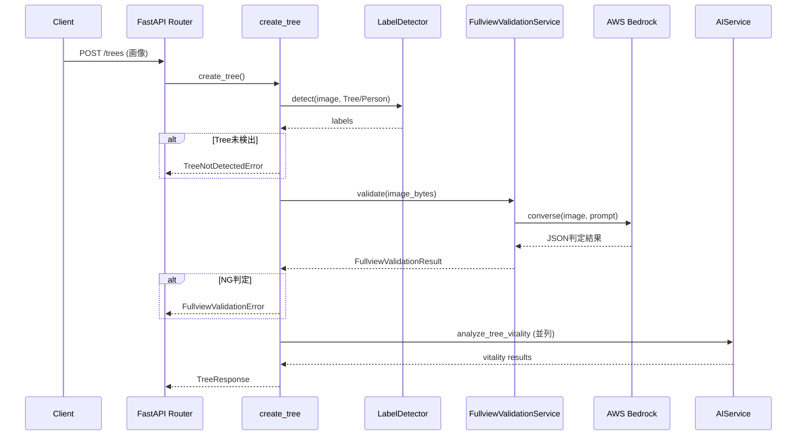
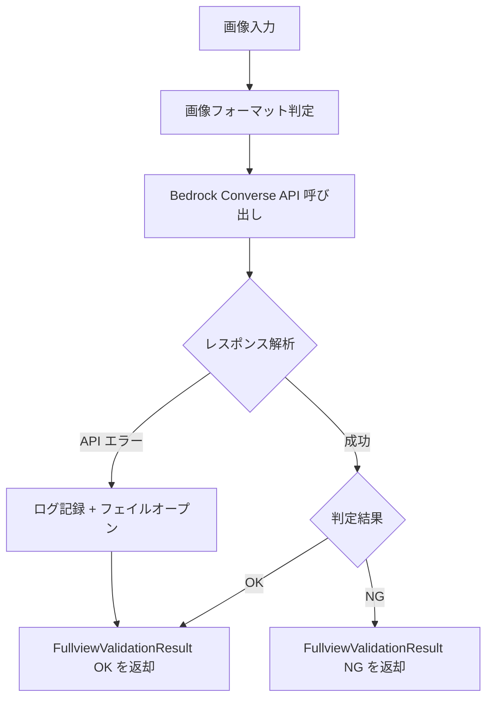

# Design Document: 桜全景バリデーション

## Overview

**Purpose**: 本機能は、桜の元気度判定パイプラインに AWS Bedrock のマルチモーダル LLM を活用した全景バリデーション段階を追加する。桜の木全体が適切に写っていない画像（枝先端のみ、幹のクローズアップ、フレームからのはみ出し等）を NG として拒否し、元気度判定の精度向上を実現する。

**Users**: システム運用者が画像品質の自動管理に利用し、エンドユーザーが不適切な写真投稿時に早期フィードバックを受け取る。開発者がデバッグ API およびデバッグページを通じて判定精度の検証・調整を行う。

**Impact**: 既存の `create_tree` パイプラインに全景バリデーション段階を追加。Rekognition ラベル検出後かつ元気度解析前に実行され、NG 判定時は早期リターンでエラーレスポンスを返却する。

### Goals
- 桜の全景として不適切な画像を元気度判定前に自動検出・拒否する
- 判定結果に理由（自然言語）と信頼度（0.0〜1.0）を付与する
- 全景バリデーション専用のデバッグ API およびデバッグページを提供する
- 既存の元気度判定デバッグページに全景バリデーション結果を統合表示する

### Non-Goals
- 全景バリデーションの判定精度の自動改善（プロンプトチューニングは手動対応）
- Rekognition ラベル検出の置き換え（既存の Tree ラベル検出は維持）
- 画像の自動クロップや構図補正
- バッチ処理による過去投稿画像の再判定

## Architecture

### Existing Architecture Analysis

現在の元気度判定パイプライン（`create_tree.py`）は以下のフローで動作する:

1. パラメータ検証・住所情報取得
2. 画像前処理（EXIF 回転）
3. Rekognition ラベル検出（`Tree` / `Person`）— 木が未検出の場合は `TreeNotDetectedError`
4. S3 アップロード + AI 元気度解析（`asyncio.gather` で並列実行）
5. 元気度推定・人物ぼかし・サムネイル作成
6. DB 登録

全景バリデーションはステップ 3 と 4 の間に挿入する。

### Architecture Pattern & Boundary Map



**Architecture Integration**:
- **Selected pattern**: 既存レイヤードアーキテクチャの拡張
- **Domain/feature boundaries**: `FullviewValidationService` は `domain/services/` に配置。Bedrock API 呼び出しとプロンプト定義を単一サービスに集約
- **Existing patterns preserved**: シングルトンファクトリ（`get_fullview_validation_service()`）、`ApplicationError` 例外階層、Pydantic レスポンススキーマ、デバッグエンドポイントパターン（JSON + HTML）
- **New components rationale**: `FullviewValidationService` — Bedrock Converse API を使用した全景判定ロジックをカプセル化。既存の `AIService` とは独立した責務（REST API 呼び出し vs LLM 判定）
- **Steering compliance**: Python 3.12、FastAPI 0.115、boto3/aioboto3、Pydantic 2.x の技術スタック準拠。型安全性ルール遵守

### Technology Stack

| Layer | Choice / Version | Role in Feature | Notes |
|-------|------------------|-----------------|-------|
| Backend / Services | Python 3.12 + FastAPI 0.115 | API エンドポイント、アプリケーションロジック | 既存スタック |
| AI / ML | AWS Bedrock Converse API + Claude Sonnet 4.5 | マルチモーダル画像判定 | モデル ID は環境変数で設定可能。デフォルト: `apac.anthropic.claude-sonnet-4-5-20250929-v1:0`（APAC クロスリージョン推論） |
| AWS SDK | boto3 | Bedrock Runtime クライアント（同期） | 新規依存なし（既存で導入済み） |
| Validation | Pydantic 2.x | リクエスト/レスポンススキーマ | 既存スタック |
| Templating | Jinja2 | デバッグ HTML ページ | 既存スタック |

> boto3（同期クライアント）を使用する理由: Bedrock Converse API の呼び出しはパイプライン内で逐次実行（NG 時は後続をスキップ）するため、`asyncio.to_thread` でラップして非同期コンテキストから呼び出す。aioboto3 は Bedrock Runtime の converse メソッドをサポートしていない可能性があるため、boto3 + スレッドプール方式を採用。
>
> **クロスリージョン推論**: Claude Sonnet 4.5 は東京リージョン（ap-northeast-1）にネイティブモデルとしてデプロイされていない。APAC クロスリージョン推論プロファイル（`apac.` プレフィックス）を使用し、APAC 内の 7 リージョン（ap-northeast-1/2/3, ap-south-1/2, ap-southeast-1/2）にルーティングされる。データは APAC 圏内に留まる。
>
> **Bedrock モデルアクセス申請**: Anthropic Claude モデルの利用には、AWS アカウントごとに一度だけ Bedrock コンソールからユースケース情報の提出が必要（即時自動承認、無料）。

## System Flows

### 全景バリデーション判定フロー



**Key Decisions**:
- Bedrock API エラー時はフェイルオープン（OK として扱い後続処理を継続）。エラーログは記録する
- `temperature: 0.0` を設定し、判定の再現性を最大化

### デバッグページ表示フロー

既存パターンと同一: GET でフォーム表示 → POST で判定実行 → 結果をテンプレートに渡して HTML レンダリング。

## Requirements Traceability

| Requirement | Summary | Components | Interfaces | Flows |
|-------------|---------|------------|------------|-------|
| 1.1 | Bedrock マルチモーダルモデルで全景判定 | FullviewValidationService | — | 判定フロー |
| 1.2 | OK/NG 判定結果の返却 | FullviewValidationService | FullviewValidationResult | — |
| 1.3 | 判定理由の返却 | FullviewValidationService | FullviewValidationResult | — |
| 1.4 | 信頼度の返却 | FullviewValidationService | FullviewValidationResult | — |
| 2.1 | 枝先端のみの画像を NG | FullviewValidationService（プロンプト） | — | — |
| 2.2 | 寄りすぎ画像を NG | FullviewValidationService（プロンプト） | — | — |
| 2.3 | はみ出し画像を NG | FullviewValidationService（プロンプト） | — | — |
| 2.4 | 全体が収まった画像を OK | FullviewValidationService（プロンプト） | — | — |
| 3.1 | Rekognition 後に全景バリデーション実行 | create_tree パイプライン統合 | — | パイプライン統合フロー |
| 3.2 | NG 時に元気度解析をスキップ | create_tree パイプライン統合 | FullviewValidationError | — |
| 3.3 | エラーレスポンスに理由・信頼度を含む | FullviewValidationError | — | — |
| 4.1 | デバッグ API で全景バリデーションのみ実行 | validate_fullview（application） | POST /debug/validate_fullview | — |
| 4.2 | 既存デバッグ認証方式を使用 | debug.py ルーター | Depends(get_current_username) | — |
| 4.3 | 他の解析処理を実行しない | validate_fullview（application） | — | — |
| 5.1 | 元気度判定デバッグページに全景結果表示 | tree_analysis.html 拡張 | — | — |
| 5.2 | OK/NG・理由・信頼度を結果テーブルに追加 | tree_analysis.html 拡張 | — | — |
| 5.3 | 全景バリデーション専用 HTML デバッグページ | fullview_validation.html | GET/POST /debug/validate_fullview_html | — |
| 6.1 | Bedrock Converse API 使用 | FullviewValidationService | — | — |
| 6.2 | API 失敗時のエラーログ・エラー返却 | FullviewValidationService | — | 判定フロー |
| 6.3 | モデル ID を環境変数で設定可能 | FullviewValidationService | — | — |
| 6.4 | プロンプト定義・構造化 JSON 受信 | FullviewValidationService | toolConfig スキーマ | — |

## Components and Interfaces

| Component | Domain/Layer | Intent | Req Coverage | Key Dependencies | Contracts |
|-----------|-------------|--------|--------------|------------------|-----------|
| FullviewValidationService | domain/services | Bedrock LLM による全景判定 | 1.1-1.4, 2.1-2.4, 6.1-6.4 | AWS Bedrock (P0) | Service |
| FullviewValidationResult | domain/services | 判定結果データクラス | 1.2-1.4 | — | — |
| FullviewValidationError | application/exceptions | NG 判定時の例外 | 3.2, 3.3 | ApplicationError (P0) | — |
| validate_fullview | application/debug | デバッグ用ユースケース | 4.1, 4.3 | FullviewValidationService (P0) | — |
| debug.py 拡張 | interfaces/api | デバッグ API エンドポイント | 4.1-4.2, 5.3 | validate_fullview (P0) | API |
| FullviewValidationResponse | interfaces/schemas | API レスポンススキーマ | 1.2-1.4, 4.1 | — | — |
| create_tree 統合 | application/tree | パイプラインへの組み込み | 3.1-3.3 | FullviewValidationService (P0) | — |
| tree_analysis.html 拡張 | interfaces/templates | デバッグページ UI 拡張 | 5.1-5.2 | — | — |
| fullview_validation.html | interfaces/templates | 専用デバッグページ | 5.3 | — | — |

### Domain / Services Layer

#### FullviewValidationService

| Field | Detail |
|-------|--------|
| Intent | AWS Bedrock Converse API を使用して桜画像の全景バリデーションを実行する |
| Requirements | 1.1, 1.2, 1.3, 1.4, 2.1, 2.2, 2.3, 2.4, 6.1, 6.2, 6.3, 6.4 |

**Responsibilities & Constraints**
- Bedrock Converse API を呼び出し、画像が桜の全景として適切かを判定する
- 判定プロンプトを管理し、NG 条件（枝先端のみ、寄りすぎ、はみ出し）を LLM に指示する
- 判定結果を `FullviewValidationResult` として構造化して返却する
- API 障害時はフェイルオープン（OK として扱う）し、エラーをログ記録する

**Dependencies**
- External: AWS Bedrock Runtime — Converse API によるマルチモーダル判定 (P0)
- External: boto3 — Bedrock Runtime クライアント (P0)

**Contracts**: Service [x]

##### Service Interface

```python
@dataclass
class FullviewValidationResult:
    """全景バリデーションの判定結果"""
    is_valid: bool          # True=OK, False=NG
    reason: str             # 判定理由（自然言語）
    confidence: float       # 信頼度（0.0〜1.0）

class FullviewValidationService:
    def __init__(
        self,
        region_name: str = os.getenv("AWS_REGION", "ap-northeast-1"),
        model_id: str = os.getenv(
            "BEDROCK_MODEL_ID",
            "apac.anthropic.claude-sonnet-4-5-20250929-v1:0"
        ),  # APAC クロスリージョン推論プロファイル
    ) -> None: ...

    async def validate(
        self,
        image_bytes: bytes,
        image_format: str,       # "jpeg" | "png" | "gif" | "webp"
    ) -> FullviewValidationResult: ...
```

- **Preconditions**: `image_bytes` は有効な画像データ。`image_format` は Bedrock がサポートするフォーマット
- **Postconditions**: `FullviewValidationResult` を返却。API 障害時は `is_valid=True` のフェイルオープン結果を返却
- **Invariants**: `confidence` は 0.0〜1.0 の範囲内

**Implementation Notes**
- `boto3.client('bedrock-runtime')` を使用し、`asyncio.to_thread` で非同期コンテキストから呼び出す
- `toolConfig` でツール定義を指定し、判定結果を構造化 JSON として取得
- `inferenceConfig.temperature` は `0.0` に設定し再現性を最大化
- シングルトンファクトリ `get_fullview_validation_service()` を提供

##### プロンプト設計

**System Prompt**:

```text
あなたは桜の木の写真を評価する画像判定の専門家です。
与えられた画像が「桜の木の全景写真」として適切かどうかを判定してください。

判定は厳密に以下の基準に従ってください。
```

**User Prompt**（画像とともに送信）:

```text
この画像が桜の木の全景写真として適切かどうかを判定してください。

## OK判定の条件
以下の条件をすべて満たす場合、OKと判定してください:
- 桜の木の幹（根元付近）から樹冠（木の上部）まで、木全体の形が概ね確認できる
- 木の主要な構造（幹・主枝・樹冠）が画像フレーム内に概ね収まっている

## NG判定の条件
以下のいずれかに該当する場合、NGと判定してください:

1. **枝先端のみ**: 幹が写っておらず、枝の先端部分や花のクローズアップのみが写っている
2. **寄りすぎ**: 幹や枝に寄りすぎており、木全体の形状（シルエット）が把握できない
3. **はみ出し**: 木の主要部分（幹・主枝・樹冠）が画像フレームから大きくはみ出しており、全体像が確認できない

## 判定の注意事項
- 木の一部（枝先や根元）が多少フレームから切れていても、全体の形状が把握できればOKとしてください
- 複数の桜の木が写っている場合、主要な1本の全景が確認できればOKとしてください
- 桜の木以外の被写体（建物、人物など）が写り込んでいても、桜の木の全景が確認できればOKとしてください
- 画像が不鮮明・暗い等の品質問題はこの判定の対象外です（OKとしてください）

判定結果をfullview_validationツールで返却してください。
```

**プロンプト設計のポイント**:
- OK 条件を先に提示し、基本的には通過させる方向の判定基準とする（過剰 NG を抑制）
- NG 条件は requirements 2.1〜2.4 に 1:1 で対応
- 「注意事項」で境界ケースの判断基準を明示し、LLM の判定ブレを低減
- ツール呼び出し指示により、toolConfig の構造化出力を確実に発動させる

**Converse API 呼び出しパラメータ**:

```python
{
    "modelId": model_id,
    "system": [{"text": SYSTEM_PROMPT}],
    "messages": [
        {
            "role": "user",
            "content": [
                {
                    "image": {
                        "format": image_format,  # "jpeg" etc.
                        "source": {"bytes": image_bytes}
                    }
                },
                {"text": USER_PROMPT}
            ]
        }
    ],
    "inferenceConfig": {
        "temperature": 0.0,
        "maxTokens": 512
    },
    "toolConfig": {
        "tools": [FULLVIEW_VALIDATION_TOOL_SPEC],
        "toolChoice": {"tool": {"name": "fullview_validation"}}
    }
}
```

- `toolChoice.tool.name` を明示指定することで、モデルが必ず `fullview_validation` ツールを呼び出すように強制する
- `maxTokens: 512` はツール呼び出しの JSON 出力に十分なサイズ

### Application / Exceptions Layer

#### FullviewValidationError

| Field | Detail |
|-------|--------|
| Intent | 全景バリデーションで NG 判定された場合の例外 |
| Requirements | 3.2, 3.3 |

**Responsibilities & Constraints**
- `ApplicationError` を継承し、NG 判定の理由と信頼度を `details` に含める
- `error_code` はプロジェクト内でユニークな番号（`114`）を割り当てる
- `status` は `400`（クライアントエラー — 不適切な画像の投稿）

**Dependencies**
- Inbound: ApplicationError — 基底例外クラス (P0)

```python
class FullviewValidationError(ApplicationError):
    def __init__(self, reason: str, confidence: float) -> None:
        super().__init__(
            reason=reason,
            error_code=114,
            status=400,
            details={"validation_reason": reason, "confidence": confidence}
        )
```

### Application / Debug Layer

#### validate_fullview

| Field | Detail |
|-------|--------|
| Intent | 全景バリデーションのみを単独実行するデバッグ用ユースケース |
| Requirements | 4.1, 4.3 |

**Responsibilities & Constraints**
- `FullviewValidationService.validate()` を呼び出し、結果を `FullviewValidationResponse` に変換して返却する
- 元気度判定やその他の解析処理は実行しない

**Dependencies**
- Inbound: debug.py ルーター — API エンドポイントからの呼び出し (P0)
- Outbound: FullviewValidationService — 判定実行 (P0)

```python
async def validate_fullview_app(
    image_data: bytes,
    fullview_validation_service: FullviewValidationService,
) -> FullviewValidationResponse: ...
```

### Interfaces / API Layer

#### debug.py 拡張（全景バリデーションエンドポイント）

| Field | Detail |
|-------|--------|
| Intent | 全景バリデーション専用デバッグ API エンドポイントの提供 |
| Requirements | 4.1, 4.2, 5.3 |

**Contracts**: API [x]

##### API Contract

| Method | Endpoint | Request | Response | Errors |
|--------|----------|---------|----------|--------|
| POST | /debug/validate_fullview | UploadFile (image) | FullviewValidationResponse | 400, 500 |
| GET | /debug/validate_fullview_html | — | HTMLResponse (フォーム) | — |
| POST | /debug/validate_fullview_html | UploadFile (image) | HTMLResponse (結果) | — |

**Implementation Notes**
- 既存デバッグエンドポイントと同一の認証方式（`Depends(get_current_username)`）を使用
- `FullviewValidationService` は `Depends(get_fullview_validation_service, use_cache=True)` で注入

### Interfaces / Schemas Layer

#### FullviewValidationResponse

| Field | Detail |
|-------|--------|
| Intent | 全景バリデーション結果の API レスポンススキーマ |
| Requirements | 1.2, 1.3, 1.4, 4.1 |

```python
class FullviewValidationResponse(BaseModel):
    """全景バリデーション結果"""
    is_valid: bool = Field(
        ..., description="全景として適切か（True=OK, False=NG）")
    reason: str = Field(
        ..., description="判定理由")
    confidence: float = Field(
        ..., description="信頼度（0.0〜1.0）", ge=0.0, le=1.0)
```

### Application / Tree Layer

#### create_tree パイプライン統合

| Field | Detail |
|-------|--------|
| Intent | 既存の元気度判定パイプラインに全景バリデーションを組み込む |
| Requirements | 3.1, 3.2, 3.3 |

**Responsibilities & Constraints**
- Rekognition ラベル検出（`Tree` 確認）の後に全景バリデーションを実行
- NG 判定時は `FullviewValidationError` を送出し、元気度解析・S3 アップロード・DB 登録をスキップ
- `create_tree` 関数の引数に `FullviewValidationService` を追加

**Implementation Notes**
- 挿入位置: `create_tree.py` の行 131（Rekognition 検出後）と行 137（画像アップロード開始前）の間
- `FullviewValidationService` は FastAPI `Depends` で注入し、`create_tree` に渡す

### Interfaces / Templates Layer

#### tree_analysis.html 拡張

| Field | Detail |
|-------|--------|
| Intent | 既存の元気度判定デバッグページに全景バリデーション結果を追加表示 |
| Requirements | 5.1, 5.2 |

**Implementation Notes**
- 既存の結果テーブルに全景バリデーション行（OK/NG、判定理由、信頼度）を追加
- `analyze_tree_app` の返却値に全景バリデーション結果を含める必要がある（`TreeVitalityResponse` スキーマの拡張）
- OK は緑色（`value-detected`）、NG は赤色（`value-not-detected`）で表示

#### fullview_validation.html

| Field | Detail |
|-------|--------|
| Intent | 全景バリデーション専用デバッグ HTML ページ |
| Requirements | 5.3 |

**Implementation Notes**
- 既存のデバッグ HTML テンプレート（`tree_analysis.html`）と同一のスタイル・レイアウトパターンを踏襲
- 画像アップロードフォーム + 結果テーブル（OK/NG、判定理由、信頼度）
- ローディングオーバーレイを含む

## Data Models

### Domain Model

本機能は新規エンティティの永続化を行わない。判定結果は API レスポンスとしてのみ返却される。

**Value Objects**:
- `FullviewValidationResult` — 判定結果（`is_valid`, `reason`, `confidence`）を保持するデータクラス

### Data Contracts & Integration

**API Data Transfer**

全景バリデーション専用デバッグ API レスポンス:
```json
{
  "is_valid": true,
  "reason": "桜の木全体が幹から樹冠まで適切に収まっています。",
  "confidence": 0.95
}
```

元気度判定パイプラインでの NG エラーレスポンス:
```json
{
  "code": 114,
  "reason": "枝の先端部分のみが写っており、桜の木の全体像が確認できません。",
  "details": {
    "validation_reason": "枝の先端部分のみが写っており、桜の木の全体像が確認できません。",
    "confidence": 0.88
  }
}
```

**Bedrock Converse API toolConfig スキーマ**:
```json
{
  "tools": [{
    "toolSpec": {
      "name": "fullview_validation",
      "description": "桜の全景バリデーション判定結果を返却する",
      "inputSchema": {
        "json": {
          "type": "object",
          "properties": {
            "is_valid": {
              "type": "boolean",
              "description": "桜の木全体が適切に写っているか"
            },
            "reason": {
              "type": "string",
              "description": "判定理由の説明"
            },
            "confidence": {
              "type": "number",
              "description": "判定の信頼度（0.0〜1.0）",
              "minimum": 0.0,
              "maximum": 1.0
            }
          },
          "required": ["is_valid", "reason", "confidence"]
        }
      }
    }
  }]
}
```

## Error Handling

### Error Strategy

| Error Type | Category | Response | Recovery |
|-----------|----------|----------|----------|
| FullviewValidationError | Business Logic (400) | error_code=114, reason, details(reason+confidence) | ユーザーが適切な全景写真を再撮影 |
| Bedrock API 障害 | System (internal) | フェイルオープン（OK として後続処理を継続） | ログ記録、運用監視 |
| Bedrock レスポンスパース失敗 | System (internal) | フェイルオープン | ログ記録、ツール定義スキーマの見直し |
| 画像フォーマット不明 | User (400) | InvalidParamError | ユーザーが対応フォーマットの画像を再送 |

### Monitoring
- Bedrock API 呼び出しの成功/失敗を `loguru` でログ記録
- API レイテンシ（呼び出し開始〜完了の時間差）をログ出力
- NG 判定率の監視（過剰な NG が発生していないか確認用）

## Testing Strategy

### Unit Tests
- `FullviewValidationService.validate()` — モック Bedrock レスポンスによる OK/NG 判定の検証
- `FullviewValidationService.validate()` — Bedrock API 障害時のフェイルオープン動作の検証
- `FullviewValidationService` — toolConfig レスポンスのパースロジックの検証
- `FullviewValidationError` — エラーコード・レスポンス形式の検証

### Integration Tests
- `POST /debug/validate_fullview` — 画像アップロード・判定結果返却の E2E テスト
- `POST /debug/validate_fullview_html` — HTML レスポンスのレンダリング検証
- `create_tree` パイプライン — 全景バリデーション NG 時の早期リターン検証
- `create_tree` パイプライン — 全景バリデーション OK 時の後続処理継続検証

## Security Considerations

- Bedrock API 呼び出しに使用する IAM 権限は `bedrock:InvokeModel` に限定する
- デバッグエンドポイントは既存の Basic 認証（`get_current_username`）で保護される
- LLM へのプロンプトインジェクション対策: ユーザー入力（画像データ）のみを LLM に送信し、テキスト入力は受け付けない

## Performance & Scalability

- **Bedrock API レイテンシ**: 1 回の呼び出しあたり 1〜3 秒を想定。パイプライン全体のレイテンシに加算される
- **コスト**: Claude Sonnet 4.5 で 1 回あたり約 $0.01。Haiku に切り替えることでコスト削減可能
- **スループット**: Bedrock のアカウントレベルのスロットリング制限に依存。高トラフィック時は Provisioned Throughput を検討
- **最適化**: `temperature: 0.0`、`maxTokens: 512`（判定結果は短文のため）で不要なトークン生成を抑制
