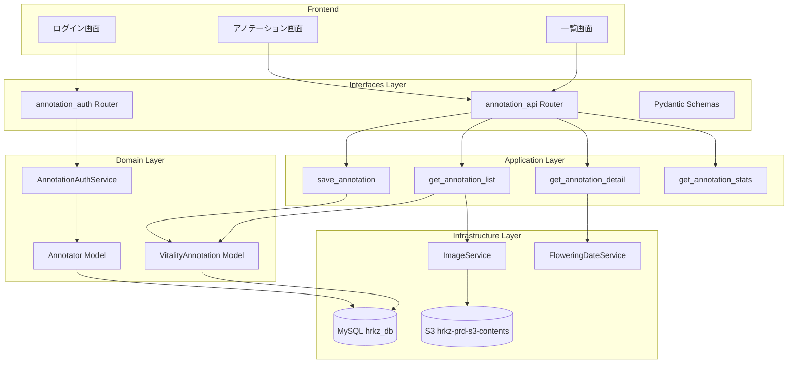
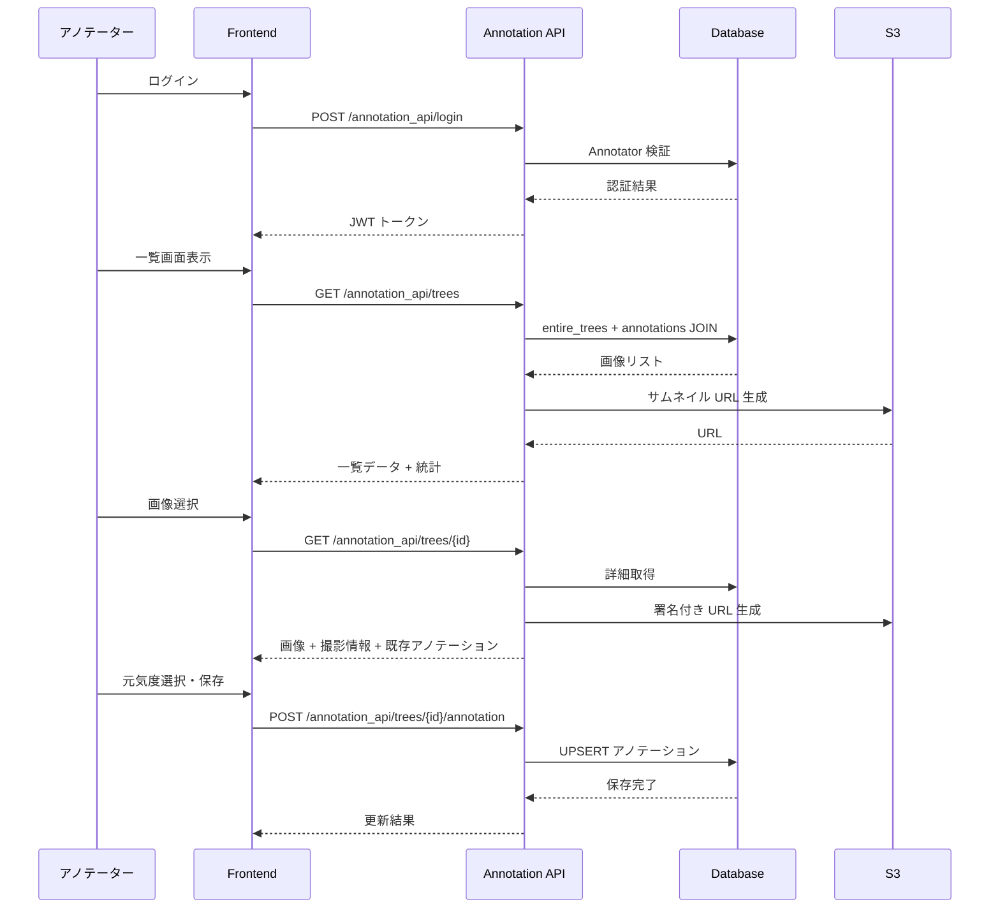
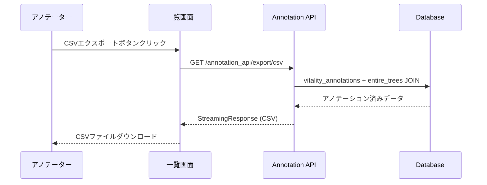
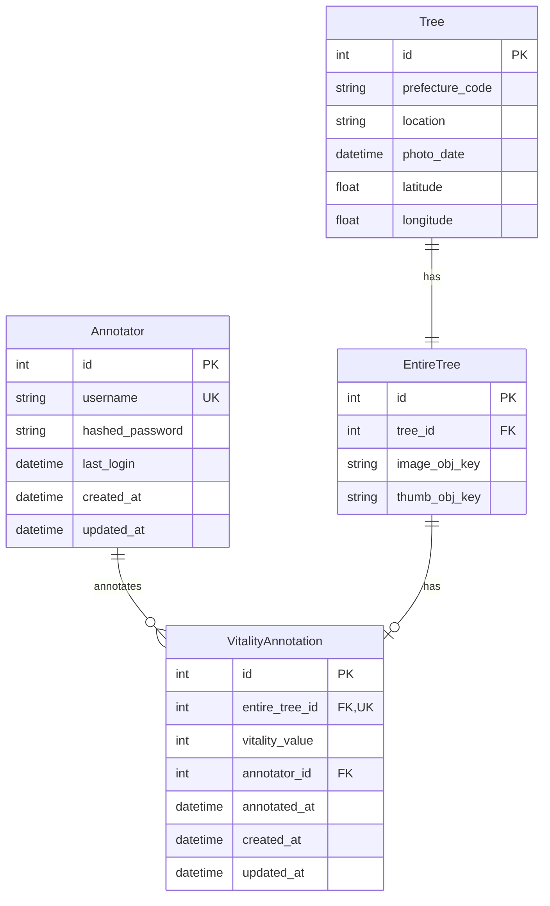

# Technical Design Document: 桜元気度アノテーションツール

## Overview

**Purpose**: S3 に保存された桜全体画像に対して、再学習用の元気度ラベルを効率的に付与するためのアノテーションツールを提供する。

**Users**: アノテーター（専任担当者）が一覧画面から対象画像を選択し、アノテーション画面で元気度（1-5 および診断不可）を入力する。

**Impact**: 既存の `entire_trees` テーブルと連携し、新規に `vitality_annotations` テーブルと `annotators` テーブルを追加。既存 API には影響を与えない独立した `/annotation_api` エンドポイントを新設。

### Goals
- アノテーターが認証後、桜画像一覧を閲覧・フィルタリングできる
- 画像ごとに元気度（1-5, -1）を入力・保存できる
- 撮影情報（撮影日、開花予想日、満開日、都道府県、撮影場所）を参照できる
- 前後ナビゲーションで連続アノテーション作業が可能

### Non-Goals
- 複数アノテーターによる同一画像への重複アノテーション管理（最新値上書き）
- アノテーション履歴の保持・監査ログ
- バッチ一括アノテーション機能
- モバイルアプリ対応

## Architecture

### Existing Architecture Analysis
- **レイヤードアーキテクチャ**: interfaces → application → domain ← infrastructure
- **認証パターン**: Admin 向け JWT + bcrypt 認証が `admin_auth.py` に実装済み
- **S3 連携**: `ImageService` で画像 URL 生成・署名付き URL 発行
- **開花日データ**: `FloweringDateService` で緯度経度から最寄り開花予想地点を取得

### Architecture Pattern & Boundary Map



**Architecture Integration**:
- **Selected pattern**: 既存レイヤードアーキテクチャの拡張
- **Domain boundaries**: `annotation` ドメインを新設し、既存 `admin` / `tree` ドメインとは独立
- **Existing patterns preserved**: 依存性注入（Depends）、シングルトンサービス、Pydantic スキーマ
- **New components rationale**: アノテーター専用認証・データモデルにより Admin 権限と分離
- **Steering compliance**: レイヤー間依存方向遵守、型安全性維持

### Technology Stack

| Layer | Choice / Version | Role in Feature | Notes |
|-------|------------------|-----------------|-------|
| Frontend | React + TypeScript + TailwindCSS | アノテーション UI | Vite でビルド、静的ファイル配信 |
| Backend | FastAPI 0.115 / Python 3.12 | REST API | 既存フレームワーク継続 |
| Data | MySQL 8.0 / SQLAlchemy 2.0 | データ永続化 | Mapped 型アノテーション |
| Storage | AWS S3 (boto3) | 画像取得 | 署名付き URL 使用 |
| Auth | python-jose (JWT) / passlib (bcrypt) | アノテーター認証 | 既存パターン踏襲 |

## System Flows

### アノテーションワークフロー



**Key Decisions**:
- 一覧取得時に統計情報（全件数・入力済み件数・元気度別件数）を同時返却
- アノテーション保存は UPSERT（存在すれば更新、なければ挿入）
- 前後ナビゲーションはフィルター条件を保持した状態で ID リストを返却

### CSV エクスポートフロー



**Key Decisions**:
- 一覧画面の統計情報エリア付近に「CSVエクスポート」ボタンを配置
- 全アノテーション済みデータをエクスポート（フィルター条件は適用しない）

## Requirements Traceability

| Requirement | Summary | Components | Interfaces | Flows |
|-------------|---------|------------|------------|-------|
| 1.1-1.5 | アノテーター認証 | AnnotatorModel, AnnotationAuthService | POST /login, GET /me | ログインフロー |
| 2.1-2.5 | 桜一覧表示 | VitalityAnnotationModel | GET /trees | 一覧取得フロー |
| 3.1-3.6 | 一覧フィルタリング | GetAnnotationList | GET /trees (query params) | 一覧取得フロー |
| 4.1-4.6 | アノテーション入力 | SaveAnnotation | POST /trees/{id}/annotation | アノテーション保存フロー |
| 5.1-5.7 | 撮影情報表示 | GetAnnotationDetail, FloweringDateService | GET /trees/{id} | 詳細取得フロー |
| 6.1-6.5 | ナビゲーション | GetAnnotationList | GET /trees (navigation) | ナビゲーションフロー |
| 7.1-7.5 | データベース設計 | AnnotatorModel, VitalityAnnotationModel | - | - |
| 8.1-8.5 | S3 画像連携 | ImageService | - | 画像取得フロー |
| 9.1-9.7 | CSV エクスポート | ExportAnnotationCsv, ListPage | GET /export/csv | CSV ダウンロードフロー |

## Components and Interfaces

| Component | Domain/Layer | Intent | Req Coverage | Key Dependencies | Contracts |
|-----------|--------------|--------|--------------|------------------|-----------|
| Annotator | Domain | アノテーターアカウント管理 | 7.2 | Database (P0) | - |
| VitalityAnnotation | Domain | アノテーション結果格納 | 7.1, 7.5 | Database (P0) | - |
| AnnotationAuthService | Domain | アノテーター認証・トークン管理 | 1.1-1.5 | Annotator (P0) | Service |
| GetAnnotationList | Application | 一覧取得・フィルタリング | 2.1-2.5, 3.1-3.6 | VitalityAnnotation (P0), ImageService (P1) | Service |
| GetAnnotationDetail | Application | 詳細・撮影情報取得 | 4.1, 5.1-5.7 | FloweringDateService (P1), ImageService (P0) | Service |
| SaveAnnotation | Application | アノテーション保存 | 4.2-4.6 | VitalityAnnotation (P0) | Service |
| GetAnnotationStats | Application | 統計情報取得 | 2.3, 2.4, 3.6 | VitalityAnnotation (P0) | Service |
| ExportAnnotationCsv | Application | CSV エクスポート | 9.1-9.6 | VitalityAnnotation (P0), EntireTree (P0) | Service |
| annotation_auth Router | Interfaces | 認証 API エンドポイント | 1.1-1.5 | AnnotationAuthService (P0) | API |
| annotation Router | Interfaces | アノテーション API エンドポイント | 2-6, 9 | Application Services (P0) | API |

### Domain Layer

#### Annotator Model

| Field | Detail |
|-------|--------|
| Intent | アノテーター認証情報の永続化 |
| Requirements | 7.2 |

**Responsibilities & Constraints**
- ユーザー ID（ユニーク）とハッシュ化パスワードを保持
- 最終ログイン日時を記録

**Dependencies**
- Outbound: Database — データ永続化 (P0)

**Contracts**: State [ ]

##### State Management
- State model: `id`, `username`, `hashed_password`, `last_login`, `created_at`, `updated_at`
- Persistence: MySQL `annotators` テーブル
- Concurrency: 楽観的ロック不要（単一レコード更新のみ）

---

#### VitalityAnnotation Model

| Field | Detail |
|-------|--------|
| Intent | 元気度アノテーション結果の永続化 |
| Requirements | 7.1, 7.5 |

**Responsibilities & Constraints**
- `entire_tree_id` ごとに 1 レコード（UNIQUE 制約）
- 元気度値: 1-5（元気度）または -1（診断不可）
- アノテーション日時・アノテーター ID を記録

**Dependencies**
- Inbound: SaveAnnotation — データ書き込み (P0)
- Inbound: GetAnnotationList — データ読み取り (P0)
- Outbound: Database — データ永続化 (P0)

**Contracts**: State [ ]

##### State Management
- State model: `id`, `entire_tree_id`, `vitality_value`, `annotator_id`, `annotated_at`, `created_at`, `updated_at`
- Persistence: MySQL `vitality_annotations` テーブル
- Concurrency: `entire_tree_id` に UNIQUE 制約、UPSERT で上書き

---

#### AnnotationAuthService

| Field | Detail |
|-------|--------|
| Intent | アノテーター認証・JWT トークン発行 |
| Requirements | 1.1-1.5 |

**Responsibilities & Constraints**
- パスワード検証（bcrypt）
- JWT トークン生成・検証
- セッション有効期限管理（30 日間）

**Dependencies**
- Inbound: annotation_auth Router — 認証リクエスト (P0)
- Outbound: Annotator Model — 認証情報取得 (P0)

**Contracts**: Service [x]

##### Service Interface
```python
class AnnotationAuthService:
    def authenticate_annotator(self, username: str, password: str) -> Annotator | None:
        """アノテーター認証を行う"""
        ...

    def create_annotator_token(self, annotator_id: int) -> str:
        """JWT トークンを生成する"""
        ...

    def verify_annotator_token(self, token: str) -> int | None:
        """JWT トークンを検証し、アノテーター ID を返す"""
        ...

    def get_annotator_by_id(self, annotator_id: int) -> Annotator | None:
        """ID からアノテーターを取得する"""
        ...
```
- Preconditions: 有効な username/password または token
- Postconditions: 認証成功時は Annotator オブジェクトまたはトークン返却
- Invariants: パスワードは平文保存しない

**Implementation Notes**
- Integration: 既存 `AuthService` のパターンを踏襲
- Validation: username 空文字チェック、password 最小長チェック
- Risks: トークン漏洩時の影響範囲（短期トークン検討）

---

### Application Layer

#### GetAnnotationList

| Field | Detail |
|-------|--------|
| Intent | フィルタリング付き桜画像一覧の取得 |
| Requirements | 2.1-2.5, 3.1-3.6 |

**Responsibilities & Constraints**
- `entire_trees` と `vitality_annotations` を LEFT JOIN
- タブフィルター: 全て / 入力済み / 未入力
- 都道府県フィルター
- 元気度フィルター（入力済み選択時のみ）
- ページネーション

**Dependencies**
- Inbound: annotation Router — API リクエスト (P0)
- Outbound: VitalityAnnotation Model — アノテーション状態取得 (P0)
- Outbound: ImageService — サムネイル URL 生成 (P1)
- Outbound: MunicipalityService — 都道府県名取得・フィルター用一覧 (P1)
- Outbound: EntireTree Model — 画像情報取得 (P0)
- Outbound: Tree Model — 都道府県コード・撮影場所取得 (P0)

**Contracts**: Service [x]

##### Service Interface
```python
@dataclass
class AnnotationListFilter:
    status: Literal["all", "annotated", "unannotated"] = "all"
    prefecture_code: str | None = None
    vitality_value: int | None = None  # 1-5, -1
    page: int = 1
    per_page: int = 20

@dataclass
class AnnotationListItem:
    entire_tree_id: int
    tree_id: int
    thumb_url: str
    prefecture_name: str
    location: str
    annotation_status: Literal["annotated", "unannotated"]
    vitality_value: int | None

@dataclass
class AnnotationStats:
    total_count: int
    annotated_count: int
    unannotated_count: int
    vitality_counts: dict[int, int]  # {1: 10, 2: 20, ...}

@dataclass
class AnnotationListResponse:
    items: list[AnnotationListItem]
    stats: AnnotationStats
    total: int
    page: int
    per_page: int

def get_annotation_list(
    db: Session,
    image_service: ImageService,
    municipality_service: MunicipalityService,
    filter: AnnotationListFilter
) -> AnnotationListResponse:
    """フィルタリング付きアノテーション一覧を取得"""
    ...
```
- Preconditions: 有効な DB セッション
- Postconditions: フィルター条件に合致する一覧と統計を返却
- Invariants: ページネーションは 1-indexed

**Implementation Notes**
- Integration:
  - 既存 `get_tree_list` (`app/application/admin/tree_list.py`) のパターンを参考
  - **都道府県名取得**: `Tree.prefecture_code` → `MunicipalityService.get_prefecture_by_code(code).name` で変換
  - **撮影場所取得**: `Tree.location` カラムから直接取得
  - **サムネイル URL**: `ImageService.get_image_url(entire_tree.thumb_obj_key)` で生成
  - **都道府県フィルター**: `Tree.prefecture_code` でフィルタリング（都道府県一覧は `MunicipalityService.prefectures` から取得）
- Validation: page >= 1, per_page 1-100
- Risks: 大量データ時のパフォーマンス（インデックス最適化）

---

#### GetAnnotationDetail

| Field | Detail |
|-------|--------|
| Intent | 単一画像の詳細情報取得 |
| Requirements | 4.1, 5.1-5.7 |

**Responsibilities & Constraints**
- S3 から画像の署名付き URL を生成
- Tree テーブルから撮影日・位置情報を取得
- FloweringDateService から開花予想日を取得
- 既存アノテーション値があれば返却

**Dependencies**
- Inbound: annotation Router — API リクエスト (P0)
- Outbound: ImageService — 署名付き URL 生成 (P0)
- Outbound: FloweringDateService — 開花日情報取得 (P1)
- Outbound: MunicipalityService — 都道府県名取得 (P1)
- Outbound: VitalityAnnotation Model — 既存アノテーション取得 (P0)
- Outbound: Tree Model — 撮影情報取得 (P0)

**Contracts**: Service [x]

##### Service Interface
```python
@dataclass
class AnnotationDetailResponse:
    entire_tree_id: int
    tree_id: int
    image_url: str  # 署名付き URL
    photo_date: datetime | None
    prefecture_name: str
    location: str
    flowering_date: str | None
    full_bloom_start_date: str | None
    full_bloom_end_date: str | None
    current_vitality_value: int | None
    current_index: int
    total_count: int
    prev_id: int | None
    next_id: int | None

def get_annotation_detail(
    db: Session,
    image_service: ImageService,
    flowering_date_service: FloweringDateService,
    municipality_service: MunicipalityService,
    entire_tree_id: int,
    filter: AnnotationListFilter
) -> AnnotationDetailResponse | None:
    """アノテーション詳細を取得"""
    ...
```
- Preconditions: 有効な entire_tree_id
- Postconditions: 画像情報・撮影情報・ナビゲーション情報を返却
- Invariants: 存在しない ID は None 返却

**Implementation Notes**
- Integration:
  - **画像 URL**: `ImageService.get_presigned_url(entire_tree.image_obj_key)` で署名付き URL 生成
  - **撮影日**: `Tree.photo_date` または `EntireTree.photo_date` から取得
  - **都道府県名**: `Tree.prefecture_code` → `MunicipalityService.get_prefecture_by_code(code).name` で変換
  - **撮影場所**: `Tree.location` カラムから直接取得
  - **開花予想日**: `FloweringDateService.find_nearest_spot(tree.latitude, tree.longitude)` で最寄りスポット検索
    - 参考 API: `GET /sakura_camera/api/info/flowering_date?latitude=...&longitude=...`
    - レスポンス: `flowering_date`, `full_bloom_date`, `full_bloom_end_date`
- Validation: entire_tree_id の存在チェック
- Risks: S3 署名付き URL 有効期限（1 時間）内の操作を想定

---

#### SaveAnnotation

| Field | Detail |
|-------|--------|
| Intent | 元気度アノテーション結果の保存 |
| Requirements | 4.2-4.6 |

**Responsibilities & Constraints**
- 元気度値のバリデーション（1-5 または -1）
- UPSERT（存在すれば更新、なければ挿入）
- アノテーション日時・アノテーター ID を記録

**Dependencies**
- Inbound: annotation Router — API リクエスト (P0)
- Outbound: VitalityAnnotation Model — データ永続化 (P0)

**Contracts**: Service [x]

##### Service Interface
```python
@dataclass
class SaveAnnotationRequest:
    entire_tree_id: int
    vitality_value: int  # 1-5, -1

@dataclass
class SaveAnnotationResponse:
    entire_tree_id: int
    vitality_value: int
    annotated_at: datetime
    annotator_id: int

def save_annotation(
    db: Session,
    annotator_id: int,
    request: SaveAnnotationRequest
) -> SaveAnnotationResponse:
    """アノテーション結果を保存"""
    ...
```
- Preconditions: 有効な entire_tree_id, vitality_value in {1,2,3,4,5,-1}
- Postconditions: DB にアノテーション結果が保存される
- Invariants: 同一 entire_tree_id への重複保存は上書き

**Implementation Notes**
- Integration: SQLAlchemy `merge()` で UPSERT 実現
- Validation: vitality_value の範囲チェック
- Risks: なし

---

#### ExportAnnotationCsv

| Field | Detail |
|-------|--------|
| Intent | アノテーション結果の CSV エクスポート |
| Requirements | 9.1-9.6 |

**Responsibilities & Constraints**
- アノテーション済みデータを CSV 形式で出力
- S3 パス、画像ファイル名、スコア（元気度）をカラムとして含める
- 診断不可（-1）のデータも含める

**Dependencies**
- Inbound: annotation Router — API リクエスト (P0)
- Outbound: VitalityAnnotation Model — アノテーション結果取得 (P0)
- Outbound: EntireTree Model — 画像オブジェクトキー取得 (P0)

**Contracts**: Service [x]

##### Service Interface
```python
@dataclass
class CsvExportRow:
    s3_path: str           # s3://hrkz-prd-s3-contents/sakura_camera/media/trees/{image_obj_key}
    image_filename: str    # image_obj_key から抽出したファイル名
    vitality_score: int    # 1-5, -1

def export_annotation_csv(
    db: Session,
    include_undiagnosable: bool = True  # -1 を含めるか
) -> StreamingResponse:
    """アノテーション結果を CSV 形式でエクスポート"""
    ...
```
- Preconditions: 有効な DB セッション
- Postconditions: CSV ファイルがストリーミングレスポンスとして返却
- Invariants: UTF-8 エンコーディング、BOM 付き（Excel 対応）

**Implementation Notes**
- Integration:
  - `vitality_annotations` と `entire_trees` を JOIN してデータ取得
  - S3 パス形式: `s3://hrkz-prd-s3-contents/sakura_camera/media/trees/{image_obj_key}`
  - ファイル名: `image_obj_key` の最後のスラッシュ以降（または全体）
- Validation: なし（全データエクスポート）
- Risks: 大量データ時はストリーミングレスポンスで対応

**CSV 出力形式**:
```csv
s3_path,image_filename,vitality_score
s3://hrkz-prd-s3-contents/sakura_camera/media/trees/abc123.jpg,abc123.jpg,3
s3://hrkz-prd-s3-contents/sakura_camera/media/trees/def456.jpg,def456.jpg,-1
```

---

### Interfaces Layer

#### annotation_auth Router

| Field | Detail |
|-------|--------|
| Intent | アノテーター認証 API エンドポイント |
| Requirements | 1.1-1.5 |

**Dependencies**
- Inbound: Frontend — 認証リクエスト (P0)
- Outbound: AnnotationAuthService — 認証処理 (P0)

**Contracts**: API [x]

##### API Contract

| Method | Endpoint | Request | Response | Errors |
|--------|----------|---------|----------|--------|
| POST | /annotation_api/login | OAuth2PasswordRequestForm | AnnotatorToken | 401 |
| GET | /annotation_api/me | Bearer Token (Header) | AnnotatorResponse | 401 |

---

#### annotation Router

| Field | Detail |
|-------|--------|
| Intent | アノテーション操作 API エンドポイント |
| Requirements | 2-6 |

**Dependencies**
- Inbound: Frontend — API リクエスト (P0)
- Outbound: GetAnnotationList, GetAnnotationDetail, SaveAnnotation — 業務処理 (P0)

**Contracts**: API [x]

##### API Contract

| Method | Endpoint | Request | Response | Errors |
|--------|----------|---------|----------|--------|
| GET | /annotation_api/trees | Query: status, prefecture_code, vitality_value, page, per_page | AnnotationListResponse | 401 |
| GET | /annotation_api/trees/{entire_tree_id} | Path: entire_tree_id, Query: filter params | AnnotationDetailResponse | 401, 404 |
| POST | /annotation_api/trees/{entire_tree_id}/annotation | Body: AnnotationRequest | SaveAnnotationResponse | 401, 400, 404 |
| GET | /annotation_api/prefectures | - | PrefectureListResponse | 401 |
| GET | /annotation_api/export/csv | Query: include_undiagnosable (default: true) | StreamingResponse (CSV) | 401 |

## Data Models

### Domain Model



**Aggregates**:
- `Annotator`: 認証ドメインのルートエンティティ
- `VitalityAnnotation`: アノテーションドメインのルートエンティティ

**Invariants**:
- `vitality_value` は 1-5 または -1 のみ許容
- `entire_tree_id` は `vitality_annotations` テーブル内でユニーク

### Physical Data Model

**annotators テーブル**

| Column | Type | Constraints | Notes |
|--------|------|-------------|-------|
| id | INT | PRIMARY KEY, AUTO_INCREMENT | |
| username | VARCHAR(50) | UNIQUE, NOT NULL | ログイン ID |
| hashed_password | VARCHAR(255) | NOT NULL | bcrypt ハッシュ |
| last_login | DATETIME | NULL | 最終ログイン日時 |
| created_at | DATETIME | NOT NULL, DEFAULT CURRENT_TIMESTAMP | |
| updated_at | DATETIME | NOT NULL, DEFAULT CURRENT_TIMESTAMP ON UPDATE | |

**vitality_annotations テーブル**

| Column | Type | Constraints | Notes |
|--------|------|-------------|-------|
| id | INT | PRIMARY KEY, AUTO_INCREMENT | |
| entire_tree_id | INT | UNIQUE, NOT NULL, FK(entire_trees.id) | 対象画像 |
| vitality_value | TINYINT | NOT NULL, CHECK (vitality_value IN (1,2,3,4,5,-1)) | 元気度 |
| annotator_id | INT | NOT NULL, FK(annotators.id) | アノテーター |
| annotated_at | DATETIME | NOT NULL | アノテーション日時 |
| created_at | DATETIME | NOT NULL, DEFAULT CURRENT_TIMESTAMP | |
| updated_at | DATETIME | NOT NULL, DEFAULT CURRENT_TIMESTAMP ON UPDATE | |

**Indexes**:
- `idx_vitality_annotations_entire_tree_id` on `entire_tree_id`
- `idx_vitality_annotations_vitality_value` on `vitality_value`
- `idx_vitality_annotations_annotator_id` on `annotator_id`

### Data Contracts & Integration

**API Data Transfer**

```python
# Request Schemas
class AnnotationRequest(BaseModel):
    vitality_value: int = Field(..., description="元気度（1-5）または診断不可（-1）")

    @field_validator("vitality_value")
    @classmethod
    def validate_vitality_value(cls, v: int) -> int:
        if v not in {-1, 1, 2, 3, 4, 5}:
            raise ValueError("vitality_value must be -1 or 1-5")
        return v

# Response Schemas
class AnnotatorToken(BaseModel):
    access_token: str
    token_type: str = "bearer"

class AnnotatorResponse(BaseModel):
    id: int
    username: str
    last_login: datetime | None
    created_at: datetime

class AnnotationListItemResponse(BaseModel):
    entire_tree_id: int
    tree_id: int
    thumb_url: str
    prefecture_name: str
    location: str
    annotation_status: str  # "annotated" | "unannotated"
    vitality_value: int | None

class AnnotationStatsResponse(BaseModel):
    total_count: int
    annotated_count: int
    unannotated_count: int
    vitality_1_count: int
    vitality_2_count: int
    vitality_3_count: int
    vitality_4_count: int
    vitality_5_count: int
    vitality_minus1_count: int

class AnnotationListResponse(BaseModel):
    items: list[AnnotationListItemResponse]
    stats: AnnotationStatsResponse
    total: int
    page: int
    per_page: int

class AnnotationDetailResponse(BaseModel):
    entire_tree_id: int
    tree_id: int
    image_url: str
    photo_date: datetime | None
    prefecture_name: str
    location: str
    flowering_date: str | None
    full_bloom_start_date: str | None
    full_bloom_end_date: str | None
    current_vitality_value: int | None
    current_index: int
    total_count: int
    prev_id: int | None
    next_id: int | None

class SaveAnnotationResponse(BaseModel):
    entire_tree_id: int
    vitality_value: int
    annotated_at: datetime
    annotator_id: int

class PrefectureResponse(BaseModel):
    code: str
    name: str

class PrefectureListResponse(BaseModel):
    prefectures: list[PrefectureResponse]
```

## Error Handling

### Error Strategy
既存プロジェクトの HTTPException パターンに従い、適切なステータスコードとメッセージを返却。

### Error Categories and Responses

**User Errors (4xx)**:
- 401 Unauthorized: 認証トークン無効・期限切れ → ログイン画面へリダイレクト
- 400 Bad Request: vitality_value 範囲外 → フィールドレベルバリデーションエラー
- 404 Not Found: entire_tree_id 存在しない → エラーメッセージ表示

**System Errors (5xx)**:
- 500 Internal Server Error: DB 接続エラー、S3 取得エラー → エラーページ表示

### Monitoring
- `loguru` によるエラーログ記録
- API エンドポイントごとのレスポンスタイム計測

## Testing Strategy

### Unit Tests
- `AnnotationAuthService.authenticate_annotator()` — 正常認証・認証失敗
- `AnnotationAuthService.verify_annotator_token()` — 有効トークン・無効トークン・期限切れ
- `save_annotation()` — 新規保存・上書き更新・バリデーションエラー
- `vitality_value` バリデーション — 範囲内・範囲外
- `export_annotation_csv()` — CSV フォーマット検証、S3 パス形式確認

### Integration Tests
- ログインフロー全体 — POST /login → GET /me
- 一覧取得 + フィルタリング — 各フィルター条件の組み合わせ
- アノテーション保存 → 一覧反映確認
- ページネーション動作確認
- CSV エクスポート — アノテーション済みデータが正しくエクスポートされる

### E2E/UI Tests
- ログイン → 一覧表示 → 詳細遷移 → アノテーション保存 → 次へ遷移
- フィルター切り替え → 該当件数更新確認
- セッション切れ時のリダイレクト確認
- CSV ダウンロード → ファイル保存確認

## Security Considerations

- **認証**: JWT トークンによるステートレス認証
- **パスワード**: bcrypt によるハッシュ化（平文保存禁止）
- **通信**: HTTPS 必須
- **トークン**: HttpOnly Cookie または Authorization ヘッダーで送信
- **CSRF**: API のみのため Cookie 認証時は SameSite 属性設定
- **認可**: アノテーターは自身のアノテーションのみ操作可能（他アノテーターの上書き可）

## Performance & Scalability

- **ページネーション**: デフォルト 20 件/ページ、最大 100 件
- **インデックス**: `entire_tree_id`, `vitality_value`, `annotator_id` にインデックス
- **S3 アクセス**: 一覧ではサムネイル URL（軽量）、詳細では署名付き URL
- **キャッシュ**: 都道府県マスターは起動時にメモリキャッシュ

## Migration Strategy

1. **Phase 1: スキーマ作成**
   - Alembic マイグレーションで `annotators`, `vitality_annotations` テーブル作成
   - 初期アノテーターアカウント投入

2. **Phase 2: API デプロイ**
   - `/annotation_api` エンドポイント追加
   - 既存 API への影響なし

3. **Phase 3: フロントエンドデプロイ**
   - 静的ファイル配信設定
   - 動作確認

**Rollback**:
- テーブル DROP で完全ロールバック可能
- API エンドポイント削除のみで機能無効化可能
